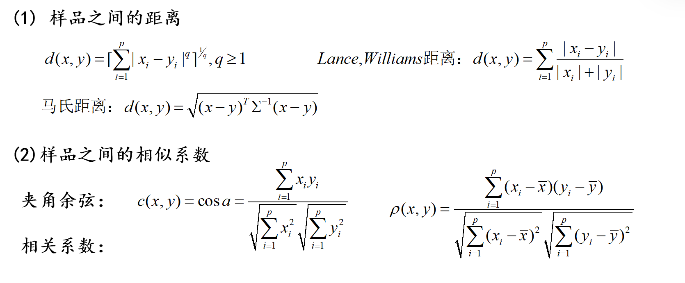
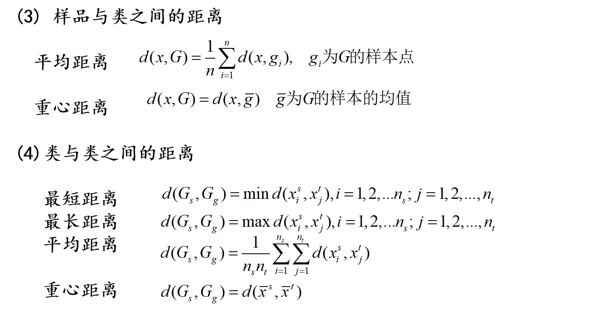
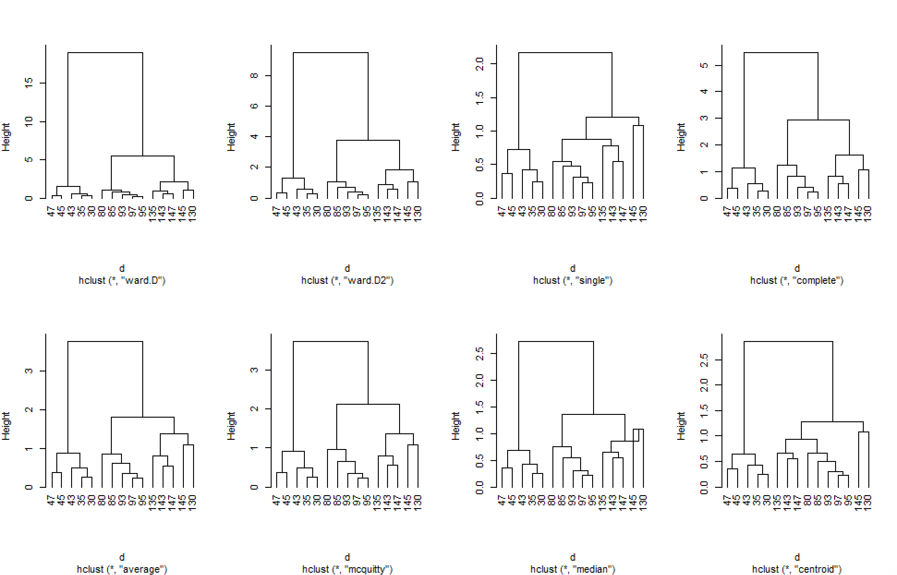
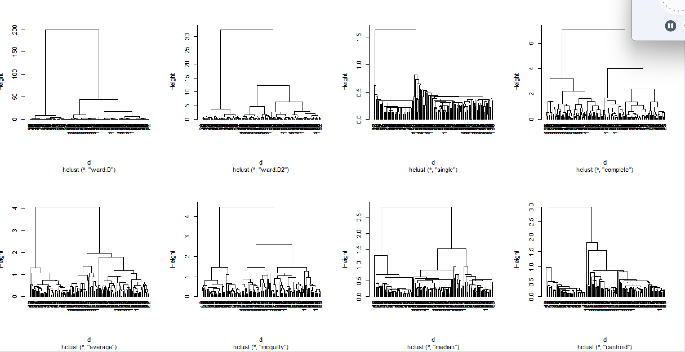

# 聚类分析

#### 原理





可以看出聚类，本身就是一个**离谁近就是哪一类**的思想

#### 系统聚类法

1. **每个样品自成1类，计算样品两两之间的距离（欧氏距离）形成矩阵D(0)**
2. **合并距离最小的两类成为新的1类，并将合并的类取消**
3. **计算距离矩阵$D^{(i)}$:对$D^{(i-1)}$删除合并的两个类所在的行和列，增加一行一列，存放新类与其他各类的距离**
4. **重复（2）（3）,直到所有的类合并成一个大类为止。**

计算距离使用 dist函数;求聚类采用 hclust函数

以iris数据为例，随机抽取三个类型各5个样本点

`sample(x, size, replace = FALSE, prob = NULL)`，其中*x*是一个向量，表示总体数据；*size*是要抽取的样本数量；*replace*指示是否进行有放回抽样；*prob*为向量中每个元素被抽中的概率

``` R
index=sample(1:50,5,replace=FALSE); index=c(index,index+50,index+100)
subiris=iris[index,];op=par(mfrow=c(2,4))
d=dist(subiris[,1:4],method='euclidean')
methods=c("ward.D","ward.D2","single","complete","average","mcquitty","median","centroid")
for(i in 1:8){ hc=hclust(d,method=methods[i]); plot(hc,hang=-1,main='') }
```



直接绘制了8种聚类方法的结果，可以看出R语言存在非常多且强大的聚类功能，而且可以看出部分聚类是大致一样的，因为这些聚类方法在一定程度上是等价的，hclust具体使用办法如下

``` R
hc=hclust(d,'single')#最短距离法
hc=hclust(d,'complete')#最长距离法
hc=hclust(d,'average')#类平均法
hc=hclust(d,'centroid')#重心法
hc=hclust(d,'median')#中心距离法
hc=hclust(d,'ward.D')#离差平方和法
cbind(hc$merge,hc$height)
plot(hc,hang=-1)
rect.hclust(hc,k=2)
```

以iris全部数据为例，执行如下代码：

``` r
my.iris=iris;  colnames(my.iris)= c('x1','x2','x3','x4','g')
d=dist(my.iris[,1:4],method='euclidean') #这个用的是欧氏距离聚类，不写的话默认马氏距离
op=par(mfrow=c(2,4))
for(i in 1:8){ hc=hclust(d,method=methods[i]); plot(hc,hang=-1,main='') }

hc=hclust(d,method=methods[4]); 
cutree(hc,k=1:5)    #将某个聚类结果hc，分成k类的结果展示
A=cutree(hc,k=3)    #分成三个类
table(A,my.iris$g)  #complete的分类效果比较。
----
A   setosa versicolor virginica
  1     50          0         0
  2      0         23        49
  3      0         27         1
```



``` R
mx=apply(my.iris[,1:4],2,mean)
W=sum(diag(var(my.iris[,1:4])*(nrow(my.iris)-1)))   #得到总离差平方和
clust=cutree(hc,k=3)  #得到分类结果
ns=table(clust)  #得到各类个数
k=max(clust)     #得到分类个数
mxs=by(my.iris[,1:4],clust,colMeans)  #得到新分类的类均值
B=0
for(i in 1:k) B=B+sum((mx-mxs[[i]])^2)*ns[i]  #计算新分类的组间离差平方和
B/W

mxs=by(my.iris[,1:4],my.iris[,5],colMeans) #得到原始分类的类均值
B=0
for(i in 1:k) B=B+sum((mx-mxs[[i]])^2)*50 #计算原始分类的组间离差平方和
B/W
```

这个我也不知道有啥用，反正随便看看

#### Kmeans聚类法

首先确定要聚类的个数：**k**

1. 在所有样本中随机选取k个样本点作为初始中心点（集合）
2. 遍历所有样本点，将每个样本点划分到最近的中心点，即聚类
3. 计算每个集合的平均值作为新的中心点
4. 重复（2）（3）,直到k个中心点(集合)不再变化为止。可能不收敛，建议设置一个迭代上限。

``` R
my.iris=iris;  colnames(my.iris)= c('x1','x2','x3','x4','g')
km=kmeans(my.iris[,1:4],centers=3)
km   #可以看到分类的一些基本信息，比如组间离差占比，分类结果等。
cbind(km$cluster,my.iris$g)
table(km$cluster,my.iris$g)   #发现主要在第2，3类之间聚类出现问题。
----
    setosa versicolor virginica
  1     50          0         0
  2      0          2        36
  3      0         48        14
```

