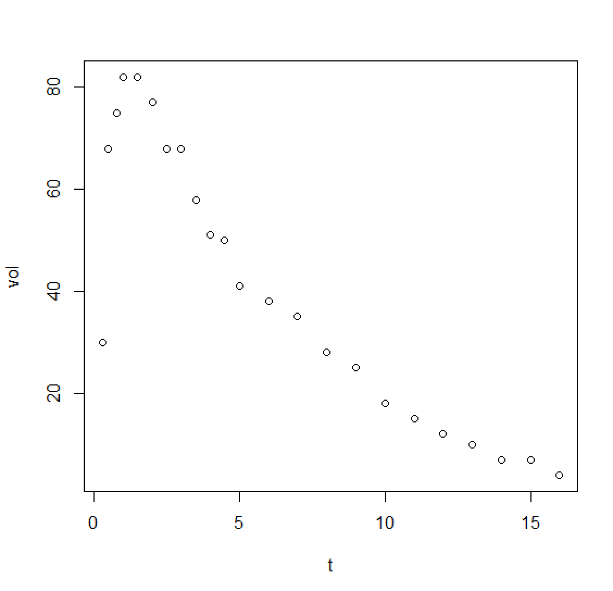
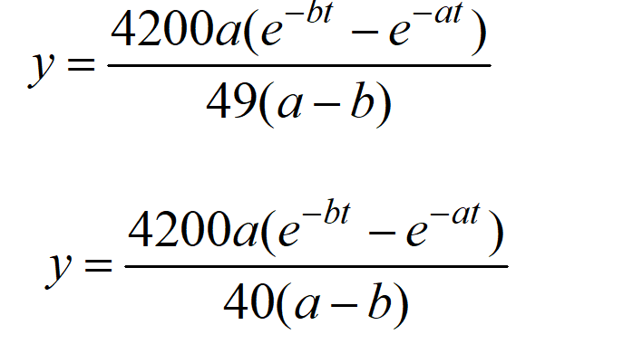
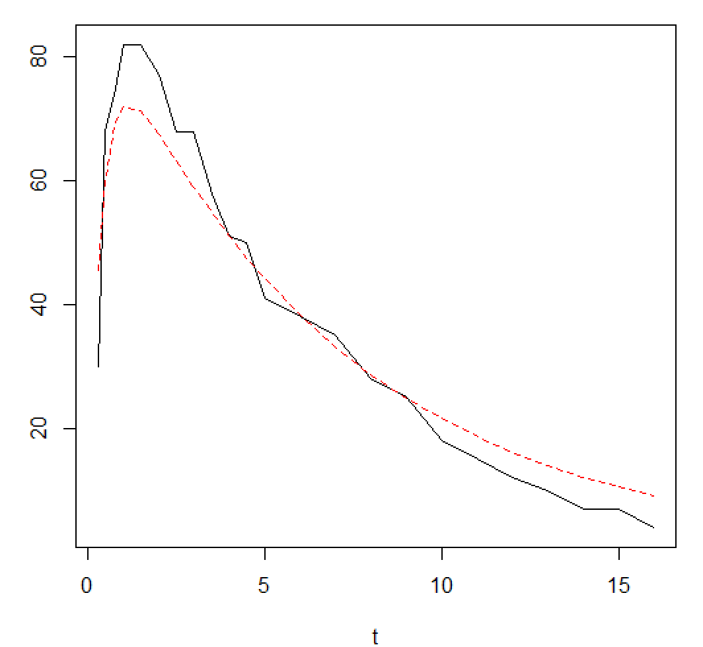

# 回归分析

#### 一般处理

| $x_1$ |  8   |  10  |   6   |  11   |   8   |   7   |  10   |   9   |  9   |   6   |  12  |   9   |
| :---: | :--: | :--: | :---: | :---: | :---: | :---: | :---: | :---: | :--: | :---: | :--: | :---: |
| $x_2$ | 135  | 150  | 124.5 | 157.6 | 129.6 | 126.1 | 134.4 | 125.8 | 129  | 116.8 | 155  | 141.9 |
|  $y$  | 29.1 | 32.2 | 24.1  |  34   | 24.5  | 23.5  | 29.8  | 23.8  | 26.7 | 23.2  | 34.5 | 30.9  |

``` R
dat=data.frame(x1=c(8,10,6,11,8,7,10,9,9,6,12,9),
         x2=c(135.0,150.0,124.5,157.6,129.6,126.1,134.4,125.8,129.0,116.8,155.0,141.9),
         y=c(29.1,32.2,24.1,34.0,24.5,23.5,29.8,23.8,26.7,23.2,34.5,30.9))
lm.out=lm(y~x1+x2,data=dat)
summary(lm.out)
----
Call:
lm(formula = y ~ x1 + x2, data = dat)

Residuals:
     Min       1Q   Median       3Q      Max 
-1.67560 -0.97038  0.01521  1.05364  1.71029 

Coefficients:
             Estimate Std. Error t value Pr(>|t|)   
(Intercept) -12.13832    5.40935  -2.244  0.05151 . 
x1            0.29059    0.42553   0.683  0.51187   
x2            0.27769    0.06116   4.540  0.00141 **
---
Signif. codes:  
0 ‘***’ 0.001 ‘**’ 0.01 ‘*’ 0.05 ‘.’ 0.1 ‘ ’ 1

Residual standard error: 1.318 on 9 degrees of freedom
Multiple R-squared:  0.9213,    Adjusted R-squared:  0.9038 
F-statistic:  52.7 on 2 and 9 DF,  p-value: 1.074e-05
```

不说了看p值就完事了，x1看起来似乎有点问题，可以猜测他可能跟x2存在自相关问题

``` R
attach(dat)
cor(x1,x2)
[1] 0.8654876
```

事实真的如此，那只能逐步回归处理了，那该怎么做呢

#### 逐步回归处理

``` R
lm2=lm(y~1,data=dat);  
step(lm2, y~x1+x2,directrion='forward')    
Start:  AIC=35.69
y ~ 1

       Df Sum of Sq     RSS    AIC
+ x2    1    182.37  16.452  7.787
+ x1    1    147.35  51.469 21.473
<none>              198.823 35.690

Step:  AIC=7.79
y ~ x2

       Df Sum of Sq     RSS    AIC
<none>               16.452  7.787
+ x1    1      0.81  15.642  9.180
- x2    1    182.37 198.823 35.690

Call:
lm(formula = y ~ x2, data = dat)

Coefficients:
(Intercept)           x2  
   -14.4929       0.3138  
```

向前回归

``` R
> step(lm.out,directrion='backward') 
Start:  AIC=9.18
y ~ x1 + x2

       Df Sum of Sq    RSS     AIC
- x1    1     0.810 16.452  7.7866
<none>              15.642  9.1804
- x2    1    35.828 51.469 21.4730

Step:  AIC=7.79
y ~ x2

       Df Sum of Sq     RSS    AIC
<none>               16.452  7.787
- x2    1    182.37 198.823 35.690

Call:
lm(formula = y ~ x2, data = dat)

Coefficients:
(Intercept)           x2  
   -14.4929       0.3138 
```

向后回归

``` R
lm3=lm(y~.,data=dat); 
step(lm3,direction='both')
---
Start:  AIC=9.18
y ~ x1 + x2

       Df Sum of Sq    RSS     AIC
- x1    1     0.810 16.452  7.7866
<none>              15.642  9.1804
- x2    1    35.828 51.469 21.4730

Step:  AIC=7.79
y ~ x2

       Df Sum of Sq     RSS    AIC
<none>               16.452  7.787
+ x1    1      0.81  15.642  9.180
- x2    1    182.37 198.823 35.690

Call:
lm(formula = y ~ x2, data = dat)

Coefficients:
(Intercept)           x2  
   -14.4929       0.3138  
```

逐步回归法

#### 非线性模型

以酒精数据为例

``` R
dat=read.table('clipboard',header=FALSE)
colnames(dat)=c('t','vol')
plot(dat)
```



看起来像什么，是不是已经一眼看出来了，他其实满足



``` R
dat=read.table('clipboard',header=FALSE)
colnames(dat)=c('t','vol')
plot(dat)

fun1=function(a,b,t)
{	
	return(4200/49*a*(exp(-b*t)-exp(-a*t))/(a-b))
}

m.1 <- nls(vol ~ fun1(a,b,t), data = dat, start = list(a=1,b=2), trace = T)

y=predict(m.1)
new_dat=cbind(dat$t,y)
plot(dat,type='l')
lines(new_dat, col = "red",
      lty = 2)
```



说实话还可以更拟合，可以微调下这个k值

#### 挑选变量准则与软件包leaps

安装leaps包，使用其中的leaps和regsubsets函数，对所有可能自变量子集进行回归并计算上述各种统计量值，从而得出最优的回归模型。

`leaps(x,y,nbest,method=c("Cp", "adjr2", "r2"))` 

x就是自变量矩阵，y是因变量，nbest是每种情况输出最佳的子集个数

可由r2推算出MSE,AIC,BIC等：

``` R
ST=sum((y-ymean)^2); 
SE=(1-R2)*ST;
AIC=nln(SE)+2*p; 
BIC=nln(SE)+pln(n)
```

以水泥放热数据为例：共有4个自变量

``` R
res=leaps(dat[,1:4],dat[,5],nbest=6,method="r2")
ymean=mean(dat[,5]); n=nrow(dat);  p=ncol(dat)-1
ST=sum((dat[,5]-ymean)^2)
SE=ST*(1-res$r2)
MSE=SE/(n-p-1)
AIC=n*log(SE)+2*apply(res$which,1,sum)
BIC=n*log(SE)+apply(res$which,1,sum)*log(n)
R2=res$r2
adR2=leaps(dat[,1:4],dat[,5],nbest=6,method="adjr2")$adjr2
res$which[max(res$r2),]#查看谁的R²最大
---
 1 2 3 4
```

懒得去做了，因为今天是元旦

``` r
语法：regsubsets(formula,data,nbest)
res=regsubsets(y~., data=dat, nbest=1)
summary(res)
---
Subset selection object
Call: regsubsets.formula(y ~ ., data = dat, nbest = 1)
4 Variables  (and intercept)
   Forced in Forced out
x1     FALSE      FALSE
x2     FALSE      FALSE
x3     FALSE      FALSE
x4     FALSE      FALSE
1 subsets of each size up to 4
Selection Algorithm: exhaustive
         x1  x2  x3  x4 
1  ( 1 ) " " " " " " "*"
2  ( 1 ) "*" "*" " " " "
3  ( 1 ) "*" "*" " " "*"
4  ( 1 ) "*" "*" "*" "*"
--
names(res)  #看到相关的输出数据
a=summary(res)
names(a)   
```

#### 任务

任务1：对专题7的数据1绘制MSE随着自变量个数变化的趋势图

任务2：对专题7的数据1实施变量挑选，给出基于残差平方和、决定系数、调整决定系数、Cp、AIC、BIC、均方误差MSE的最优回归计算表格，形如变量集合 SE  R2  AdjR2  MSE  Cp  AIC  BIC

任务3：探讨是否由更适合数据1的回归模型


