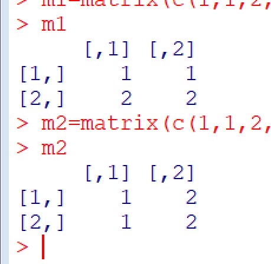

#  关于$\pi$的例子

现在有一个文件**pi20w.txt**，里面装着**$\pi$**小数点后20万的数字

#### 引用概念：

**二维数组**：**array, matrix** :通常存储同类型等长度的数据，如矩阵。

**数据框**：**data.frame** ：通常存储等长度、类型可不同的以列为变量数据，如数据库二维表，Excel的表格数据，统计分析常见的多元样本。**data.frame**以列为变量并可命名，并通过名字访问;当**data.frame**中的类型都相同时，可以转化成**matrix**;**matrix**都可以转化成**data.frame.**

**列表：list**，可存储不等长度，不同类型的对象，是超级大容器。**list**的每个子对象都可以命名，可通过名字访问。

##### 生成3x3的单位矩阵；并对三个列命名为x1,x2,x3;访问第3列；访问第2行；访问（第1-2行及第2-3列）

``` r
x1=matrix(c(1,0,0,0,1,0,0,0,1),nrow=3,byrow=TRUE)
x2=diag(c(1,1,1));   colnames(x1)=c('x1','x2','x3')
x1[,3]
x1[2,]
x1[1:2,2:3]
```

##### 按行序生成两个2x2的矩阵m1值为1,1,2,2；m2值为1,2,2,1

``` r
m1=matrix(c(1,1,2,2),nrow=2,byrow=TRUE)
m2=matrix(c(1,1,2,2),nrow=2)
```

m1跟m2分别为：




#### 导入数据

1. scan文件读取字符到变量x
2. 将字符串x分解成字符数组
3. 将字符数组转化成整数数组

```r
x=scan('pi20w.txt',what='character')
x=unlist(strsplit(x,''))
x=as.integer(x)
head(x)#用来查看数据是否正确导入
```

#### 将所有数字按顺序分解成2万*10的一个整数矩阵，快速计算各行，各列的均值、标准差、极值、中位数等各种指标。

``` R
fun2=function(n) max(n)-min(n)

x1=matrix(x,nrow=20000,byrow=TRUE)

x1.mean1=apply(x1,1,mean)
x1.mean2=apply(x1,2,mean)

x1.sd1=apply(x1,1,sd)
x1.sd2=apply(x1,2,sd)

x1.range1=apply(x1,1,fun2)
x1.range2=apply(x1,2,fun2)

x1.median1=apply(x1,1,median)
x1.median2=apply(x1,2,median)
```

**fun2**是用来计算极差的

#### 针对10列数据，绘制每列各数字的分布图，并进行对比

``` r
```


