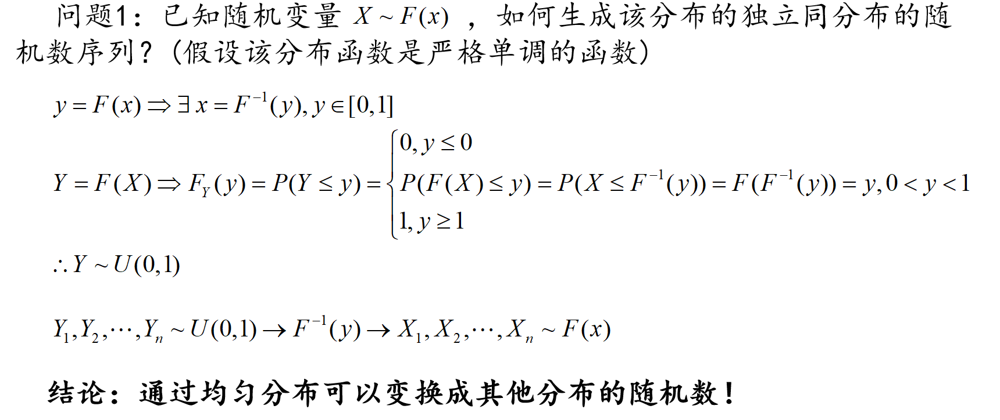
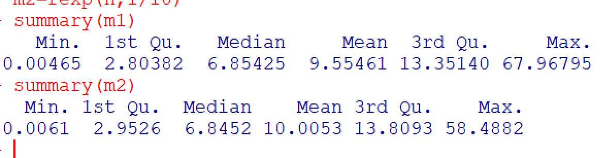
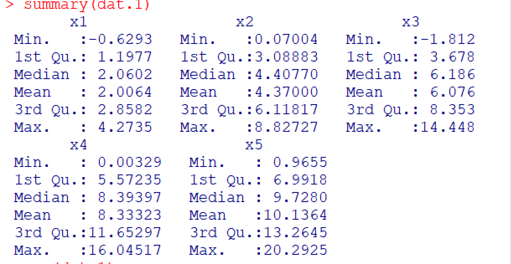
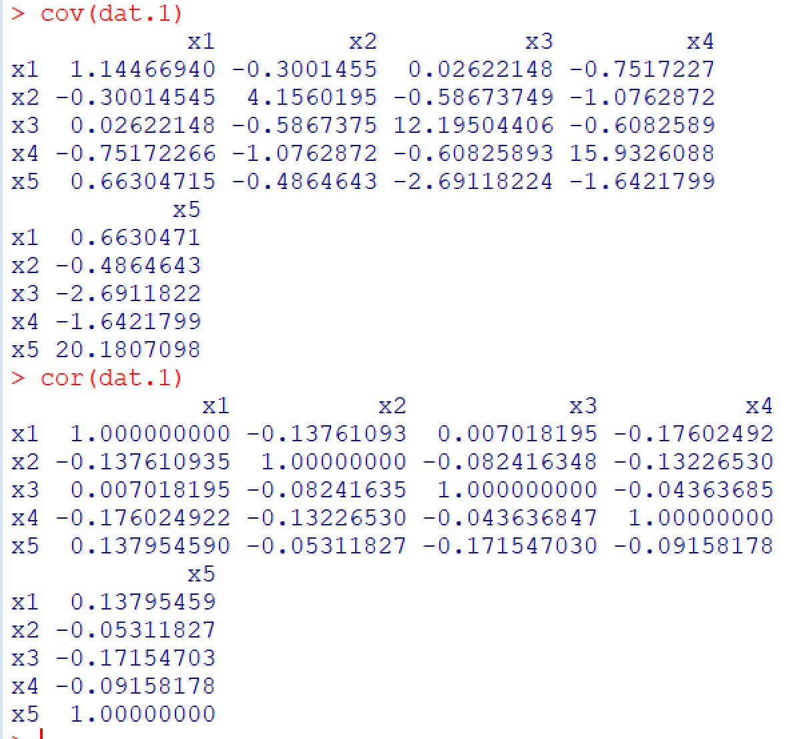
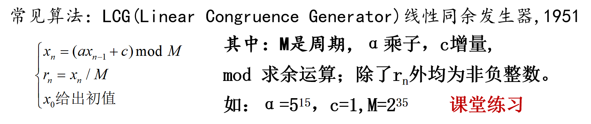
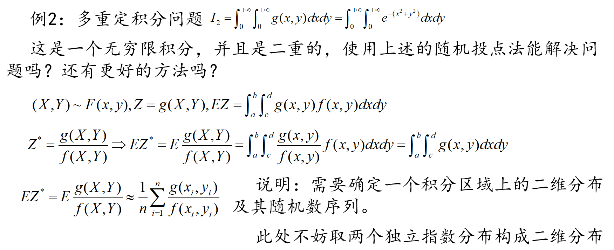
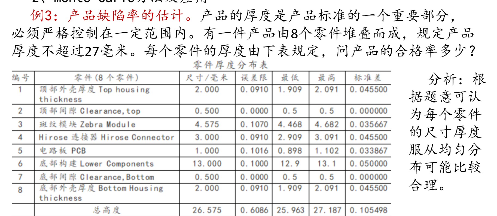

# 随机模拟

#### 已知随机变量${X\sim F(x)}$，如何生成该分布的独立同分布的随机数序列？(假设该分布函数是严格单调的函数)



#### 请利用上述结论生成指数分布E(a)的随机数，并与R中的rexp进行比较。


``` R
runif(n, min = 0, max = 1)
```


**runif(n, min = 0, max = 1)**，生成n个随机的0到1的小数

``` R
fun=function(n,a)
{	
	c=runif(n, min = 0, max = 1)
	for(i in 1:n) 	c[i]=-1/a*log(1-c[i])
	return(c)
}
set.seed(123)
n=1000
m1=fun(n,1/10)
m2=rexp(n,1/10)
summary(m1)
summary(m2)
```



说实话，看起来有点像，当然要看相似情况，应该做更多分析

#### 生成相互独立的随机向量$(x1,x2,...,x5)$的样本，其中${x_i\sim N(2i,i)}$样本容量50。

1. #### 计算样本的数字特征：均值、协方差、相关阵；并判断是否与理论上总体的数字特征相一致。

2. #### 计算样本的距离矩阵：欧氏距离，马氏距离

``` R
rnorm(n, mean = m, sd = s)
```

生成n个服从均值为m，方差为s的正态分布的随机数。

``` R
dat=c()
for(i in 1:5) 	dat=c(dat,rnorm(50, mean = 2*i, sd = i))
dat.1=matrix(dat,nrow=50)
colnames(dat.1)=c('x1','x2','x3','x4','x5')
summary(dat.1)
cov(dat.1)
cor(dat.1)
```

情况就是个这么情况





有没有关系自己看吧

``` R
#欧式距离
dist(dat.1)
#马氏距离
Cov=cov(dat.1)
Cor=cor(dat.1)
Mean=colMeans(dat.1)
eCov <- eigen(Cov)   # 计算Cov矩阵的特征值与特征向量
SrDIV <- diag(eCov$values^(-1/2)) # 用特征值的-1/2次方生成对角矩阵
U <- eCov$vectors   # Cov矩阵的特征向量
SrDIV <- U %*% SrDIV %*% t(U)
Y <- as.matrix(dat.1) %*% SrDIV
MD <- dist(Y)
MD
```

以上欧氏距离和马氏距离代码参考于[^1],因为没时间写

#### 总体${x_1\sim N(1,1)}$，$x_2\sim N(3,2)$,若$x$=2,请判断$x$属于$x1$还是$x2$总体？

``` R
dnorm(2, 1, 1)
dnorm(2, 3, 2)
```

计算当${x}$=2的时候，比较两种情况下的概率密度值大小，概率密度值大的为${x_1\sim N(1,1)}$，所以${x}$属于$x1$

#### 样本x1=rnorm(100,1,1);x2=rnorm(100,3,2),若x=2，请判断x属于x1还是x2所在的总体

``` R
# 生成两组随机样本
x1 <- rnorm(100, 1, 1)
x2 <- rnorm(100, 3, 2)
# 计算x = 2在两个总体下的概率密度
density_x1 <- dnorm(2, mean = mean(x1), sd = sd(x1))
density_x2 <- dnorm(2, mean = mean(x2), sd = sd(x2))
```

与前面方法相同，代码是ai写的

#### 如何生成均匀分布随机数？

这个部分我们明天再看,ok我回来了



``` R
func1 <- function(n, m, a, c,seed_value =1) {
    seq <- numeric(n)
    for (i in 1:n) {
        xn = (a * seed_value + c) %% m
        seq[i] <- xn
        seed_value <- xn/10
    }
    return(seq/m)
}
func1(50,2^35,5^15,1)
```

我自己写的，感觉还挺麻烦的，看看ai写的吧

``` R
# 定义 LCG 参数
a <- 1664525
c <- 1013904223
m <- 2^32
seed <- 12345  # 初始种子
# LCG 函数
lcg <- function(n, seed, a, c, m) {
  random_numbers <- numeric(n)
  random_numbers[1] <- seed
  for (i in 2:n) {
    random_numbers[i] <- (a * random_numbers[i - 1] + c) %% m
  }
  return(random_numbers / m)  # 归一化到 [0, 1)
}
# 生成 10 个伪随机数
n <- 10
random_numbers <- lcg(n, seed, a, c, m)
print(random_numbers)
```

#### Monte-Carlo方法及应用



``` R
N=10000;  x=rexp(N,1); y=rexp(N,1)
zfun=function(x,y) exp(-x^2-y^2)/exp(-x-y)
mean(zfun(x,y))   #输出估计结果

#下面求解比较精确的结果
a=integrate(function(x) exp(-x^2),0,Inf)
a$value^2   
```

前面这个是模拟的，后面这个是比较精确的。前面的本质就是一种估计方法，**非常巧妙十分推荐**



思路：不妨随机构造容量为N=100000 的样本，每个样本点由上述八个零件的随机高度构成，通过计算总高度不超过27毫米的样本点频率来估计合格品的概率。

 除了零件号**2和7**的厚度不允许偏差外，假设其他零件的厚度在最低厚度与最高厚度构成的取值区间上服从均匀分布。显然，根据独立同分布中心极限定理可知，基于每个样本点的总和可认为是独立同分布，故这N个总和近似服从正态分布。

为了更好地估计合格率，我们设计的实验默认为10组，每组各100000次。取这10次模拟的合格率的平均值来判断。

``` R
qualify=function(groups=10,n=100000)
{	avg=numeric(groups)
   for(i in 1: groups)
  { x=runif(n,1.909,2.091)
    x=x+1.0    #2，7之和
    x=x+runif(n,4.468,4.682);       x=x+runif(n,2.909,3.091)
    x=x+runif(n,0.898,1.102);      x=x+runif(n,12.9,13.1)
    x=x+runif(n,1.909,2.091)
    avg[i]=sum(x<=27)/n
  }  
  hist(x,main='Last simulation',xlab='overall thickness')
  list(groups = groups,each_n=n,each_mean=avg,total_mean=mean(avg))
	return(mean(avg))
}
qualify()
```


估计的结果为0.999627，说明产品的合格率大概为99.963%，或者认为十万个产品中大约有37个不合格。

**感觉也挺巧妙的**

#### 从1到50中任取5个构成组合，并从中随机选取1000个组合，计算每个组合的（最小值、中位数、最大值），最后给出三个值各自的平均值。

``` R
coms=combn(50,5)          #耗时：1.74秒
cfun=function(x) return(c(min(x),median(x),max(x)))
a=apply(coms,2,cfun)   #全部组合计算耗时：90.19秒
apply(a,1,mean)           
com1=coms[,sample(ncol(coms),1000)]        #这个非常快
a=apply(com1,2,cfun);  apply(a,1,mean)     #结果与全部计算相近
```

**com1=coms[,sample(ncol(coms),1000)]** 整体意思就是从`coms`数据结构里随机抽取 1000 列，将抽取出来的这些列数据赋值给变量`com1`。

**combn(n,r) **从n里拿r的各种可能性组合。但是这种可能性太多了过于复杂，因此可以专业的软件包**RcppAlgos**可快速实现。

要先下载包

``` R
install.packages('RcppAlgos')
```

导入包

``` R
library(RcppAlgos)
cfun=function(x) return(c(min(x),median(x),max(x)))
a=comboSample(v=50,m=5,n=1000,seed=10,namedSample=TRUE,FUN=cfun)
a=matrix(unlist(a),nrow=1000,byrow=TRUE,dimnames=list(names(a)))
apply(a,2,mean)      #上述整个过程不到0.1秒，效率太高了！
结果：
8.502 25.339 42.145
```

**comboGeneral(v,m,FUN)** 从数据v中提取m个构成组合再用FUN计算组合**comboSample(v,m,n,namedSample,seed,FUN)** 从数据v中提取m个构成组合并按照随机种子seed从中随机选取n个执行FUN函数，选取的行名称是否输出由`namedsample`决定。注意此时返回的是list，可能需要处理成矩阵。


[^1]:https://blog.csdn.net/qq_41196612/article/details/104949453
