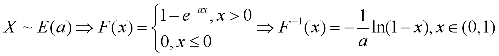

# 随机模拟

#### 已知随机变量${X\sim F(x)}$，如何生成该分布的独立同分布的随机数序列？(假设该分布函数是严格单调的函数)


#### 请利用上述结论生成指数分布E(a)的随机数，并与R中的rexp进行比较。



``` R
runif(n, min = 0, max = 1)
```


**runif(n, min = 0, max = 1)**，生成n个随机的0到1的小数

``` R
fun=function(n,a)
{	
	c=runif(n, min = 0, max = 1)
	for(i in 1:n) 	c[i]=-1/a*log(1-c[i])
	return(c)
}
set.seed(123)
n=1000
m1=fun(n,1/10)
m2=rexp(n,1/10)
summary(m1)
summary(m2)
```


说实话，看起来有点像，当然要看相似情况，应该做更多分析

#### 生成相互独立的随机向量$(x1,x2,...,x5)$的样本，其中${x_i\sim N(2i,i)}$样本容量50。

1. #### 计算样本的数字特征：均值、协方差、相关阵；并判断是否与理论上总体的数字特征相一致。

2. #### 计算样本的距离矩阵：欧氏距离，马氏距离

``` R
rnorm(n, mean = m, sd = s)
```

生成n个服从均值为m，方差为s的正态分布的随机数。

``` R
dat=c()
for(i in 1:5) 	dat=c(dat,rnorm(50, mean = 2*i, sd = i))
dat.1=matrix(dat,nrow=50)
colnames(dat.1)=c('x1','x2','x3','x4','x5')
summary(dat.1)
cov(dat.1)
cor(dat.1)
```

情况就是个这么情况


有没有关系自己看吧

``` R
#欧式距离
dist(dat.1)
#马氏距离
Cov=cov(dat.1)
Cor=cor(dat.1)
Mean=colMeans(dat.1)
eCov <- eigen(Cov)   # 计算Cov矩阵的特征值与特征向量
SrDIV <- diag(eCov$values^(-1/2)) # 用特征值的-1/2次方生成对角矩阵
U <- eCov$vectors   # Cov矩阵的特征向量
SrDIV <- U %*% SrDIV %*% t(U)
Y <- as.matrix(dat.1) %*% SrDIV
MD <- dist(Y)
MD
```

以上欧氏距离和马氏距离代码参考于[^1],因为没时间写

#### 总体${x_1\sim N(1,1)}$，$x_2\sim N(3,2)$,若$x$=2,请判断$x$属于$x1$还是$x2$总体？

``` R
dnorm(2, 1, 1)
dnorm(2, 3, 2)
```

计算当${x}$=2的时候，比较两种情况下的概率密度值大小，概率密度值大的为${x_1\sim N(1,1)}$，所以${x}$属于$x1$

#### 样本x1=rnorm(100,1,1);x2=rnorm(100,3,2),若x=2，请判断x属于x1还是x2所在的总体

``` R
# 生成两组随机样本
x1 <- rnorm(100, 1, 1)
x2 <- rnorm(100, 3, 2)
# 计算x = 2在两个总体下的概率密度
density_x1 <- dnorm(2, mean = mean(x1), sd = sd(x1))
density_x2 <- dnorm(2, mean = mean(x2), sd = sd(x2))
```

与前面方法相同，代码是ai写的

#### 如何生成均匀分布随机数？

这个部分我们明天再看


[^1]:https://blog.csdn.net/qq_41196612/article/details/104949453
