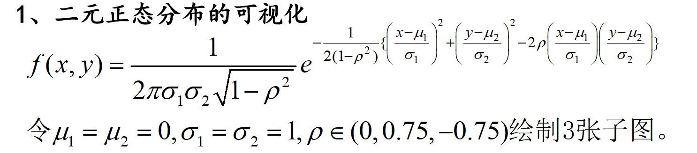
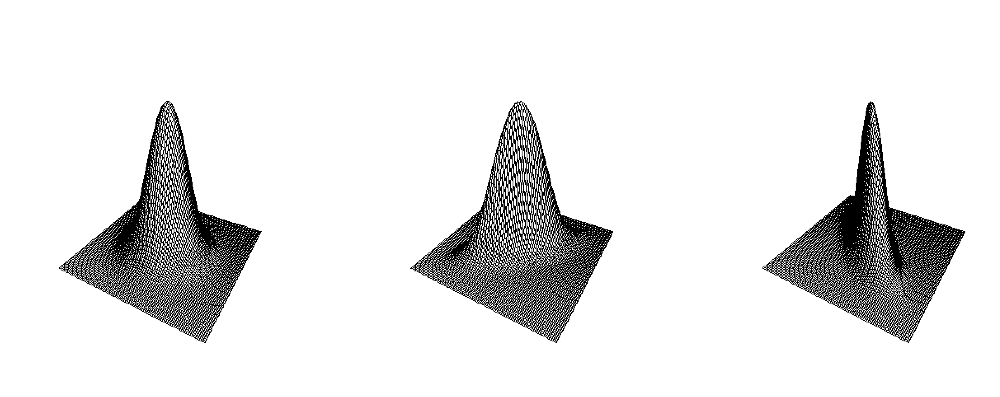
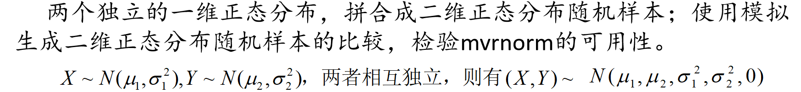
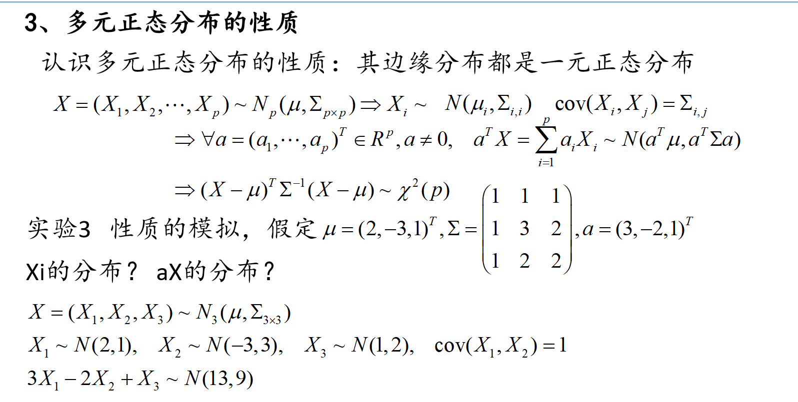
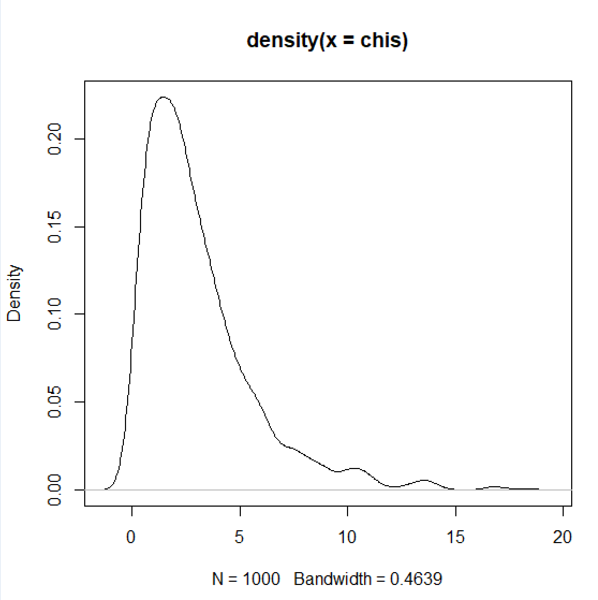
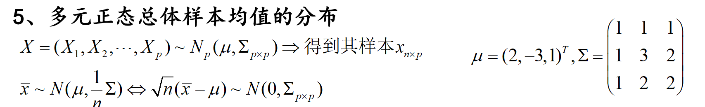
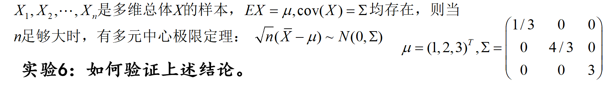
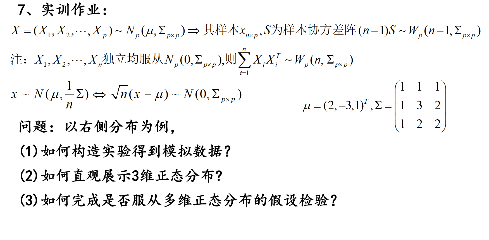

# 多元正态分布的模拟

#### 针对不同的相关系数，绘制二元正态密度图



``` R
fun=function(x,y,mu=c(0,0),sigma=c(1,1),rho=0)
{ xs=(x-mu[1])/sigma[1];  ys=(y-mu[2])/sigma[2];
  res=exp(-(xs^2+ys^2-2*rho*xs*ys)/(2*(1-rho^2)))/(2*pi*sigma[1]*sigma[2]*sqrt(1-rho^2))
  return(res)
}
x=seq(-4,4,length=100); y=x;  rho=c(0,0.75,-0.75)
op=par(mfrow=c(1,3))
for(i in rho)
{  z=outer(x,y,fun,rho=i);    persp(z,box=F,phi=30,theta=30) }
par(op)
```



画的结果还挺显著的，代码来源于[^1]的配套资料

#### 从一维到二维的模拟比较

##### MASS

R软件MASS包中的mvrnorm函数，专门用来实现多维正态分布的抽样。

``` R
mvrnorm(n = 1, mu, Sigma, tol = 1e-6, empirical = FALSE, EISPACK = FALSE)
```


该函数中n表示随机样本容量，mu表示均值向量，Sigma表示协方差矩阵, tol表示相对于最大协方差的偏差精度,empirical表示是否使用经验分布的均值和协方差矩阵，而不是总体的均值和协方差矩阵。



```R
n=100;  x=rnorm(n, 0, 2);      y=rnorm(n,0,2);    xy1=cbind(x,y)
mu=c(0,0);   Sigma=diag(c(4,4));      
xy2=mvrnorm(n,mu,Sigma) #用MASS做的
#比较xy1,xy2的均值、标准差、协方差或相关系数矩阵、核密度图等
apply(xy1,2,mean);  apply(xy2,2,mean); apply(xy1,2,sd);   apply(xy2,2,sd);  
-------------------
        x         y 
0.1433426 0.2295693 
[1] 0.1715443 0.3892977
       x        y 
1.909475 1.935676 
[1] 1.967243 2.074805
-------------------
cor(xy1);  cor(xy2);         #随着n的增大，两者的差异性如何？
-------------------
            x           y
x  1.00000000 -0.09421824
y -0.09421824  1.00000000
           [,1]       [,2]
[1,] 1.00000000 0.07691529
[2,] 0.07691529 1.00000000
-------------------
```

其实说明了模拟在样本量比较小的时候并不是非常有效

#### 认识多元正态分布的性质：其边缘分布都是一元正态分布



``` R
mu=c(2,-3,1);   Sigma=matrix(c(1,1,1,1,3,2,1,2,2),nrow=3,byrow=TRUE)
a=c(3,-2,1) ;   zmean=sum(a*mu);   zvar=t(a)%*%Sigma%*%a
xy=mvrnorm(1000,mu,Sigma)
apply(xy,2,mean);    apply(xy,2,var);   cov(xy);  cor(xy[,1],xy[,2])
z=a[1]*xy[,1]+a[2]*xy[,2]+a[3]*xy[,3]
mean(z);  var(z)

chifun=function(x,mu,Sigma)  t(x-mu)%*%solve(Sigma)%*%(x-mu)
chis=apply(xy,1,chifun,mu=mu,Sigma=Sigma);  
plot(density(chis))
```



这是概率密度曲线图,可以看出xy满足卡方分布（我后面再验证下，可能是错的）

#### 多元正态总体参数的估计

##### 这个[R语言语法的学习](../1/1.R语言语法的学习.md)有写一些，一般常用那些。

#### 生成以下3元正态分布的100个随机样本并计算均值，重复执行1000次，得到1000个均值向量，验证基本的特征。



```R
mu=c(2,-3,1)
Sigma=matrix(c(1,1,1,1,3,2,1,2,2),nrow=3)
mx=matrix(0,nrow=1000,ncol=3)
for(i in 1:1000)
{   x=mvrnorm(100,mu,Sigma);     mx[i,]=apply(x,2,mean); }
apply(mx,2,mean);  cov(mx);  Sigma/100
----
[1]  1.9961462 -2.9998708  0.9935377
           [,1]       [,2]       [,3]
[1,] 0.01027212 0.01017959 0.01007285
[2,] 0.01017959 0.02999573 0.02032123
[3,] 0.01007285 0.02032123 0.01992643
     [,1] [,2] [,3]
[1,] 0.01 0.01 0.01
[2,] 0.01 0.03 0.02
[3,] 0.01 0.02 0.02
```

#### 多元非正态总体样本均值的分布（多元中心极限定理）



假设3维独立的均匀分布U(0,2),U(0,4),U(0,6)满足上述条件

``` R
N=1000; n=100;  mu=c(1,2,3); Sigma=diag(c(1/3,4/3,3))
mx=matrix(0,nrow=1000,ncol=3);
for(i in 1:N)
{   x=cbind(runif(n,0,2),runif(n,0,4),runif(n,0,6));
    mx[i,]=apply(x,2,mean)-mu; }
mx=sqrt(n)*mx;    mean(mx);   var(mx); cor(mx)
---
[1] -0.003478091
            [,1]       [,2]        [,3]
[1,]  0.33548270 0.04415002 -0.03357084
[2,]  0.04415002 1.31348487  0.09182243
[3,] -0.03357084 0.09182243  3.09767735
            [,1]       [,2]        [,3]
[1,]  1.00000000 0.06650944 -0.03293131
[2,]  0.06650944 1.00000000  0.04552166
[3,] -0.03293131 0.04552166  1.00000000
```

每次的结果都不一样，但是会发现mx的均值会趋向于0，var(mx)也会趋向于diag(c(1/3,4/3,3))



##### 构造模拟数据

```R
func1 <- function(N, p, mu, Sigma) {
    mx <- matrix(0, nrow = N, ncol = length(mu))
    for (i in 1:N) {
        # 从多元正态分布中抽取样本
        x <- mvrnorm(n = p, mu = mu, Sigma = Sigma)
        mx[i, ] <- apply(x, 2, mean) - mu
    }
    mx <- sqrt(p) * mx
    result <- list(
        mean_mx = mean(mx),
        var_mx = var(mx),
        cor_mx = cor(mx)
    )
    return(result)
}
p=10
func1(N,p,mu,Sigma)
$mean_mx
[1] -0.0003303889

$var_mx
          [,1]      [,2]      [,3]
[1,] 0.9453045 0.9714135 0.9497618
[2,] 0.9714135 3.0948467 2.0067312
[3,] 0.9497618 2.0067312 1.9604429

$cor_mx
          [,1]      [,2]      [,3]
[1,] 1.0000000 0.5679351 0.6976727
[2,] 0.5679351 1.0000000 0.8146903
[3,] 0.6976727 0.8146903 1.0000000
```

##### 直观展示三维正态分布

```  R
data <- func1(N, p, mu, Sigma)
# 抽取的样本数据
x <- mvrnorm(N, mu, Sigma)

# 使用rgl绘制3D散点图
open3d()
points3d(x[, 1], x[, 2], x[, 3], size = 3, col = "blue")
axes3d(edges = c("x--", "y--", "z--"), 
       ntick = 5,            # 坐标轴刻度数量
       labels = TRUE,       # 是否显示坐标轴标签
       col = "black")       # 坐标轴颜色
```


说实话，没啥用

#### 如何完成是否服从多维正态分布的假设检验？

可以通过假设检验啊

今天脑子有点乱，感觉有点没思路，明天再看下

----

[^1]:创新统计思维：让数据说话 / 吕书龙，刘文丽主编. —北京：电子工业出版社，2023.12 ISBN 978-7-121-46810-0