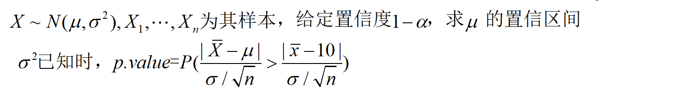
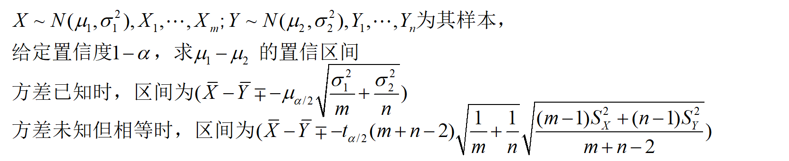
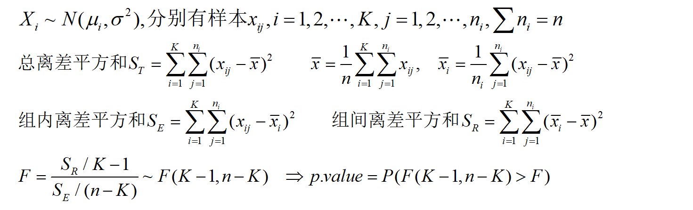
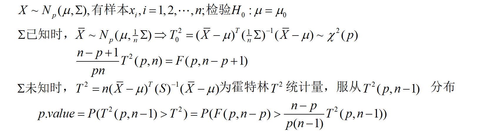
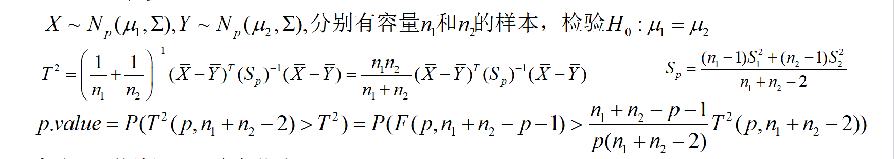
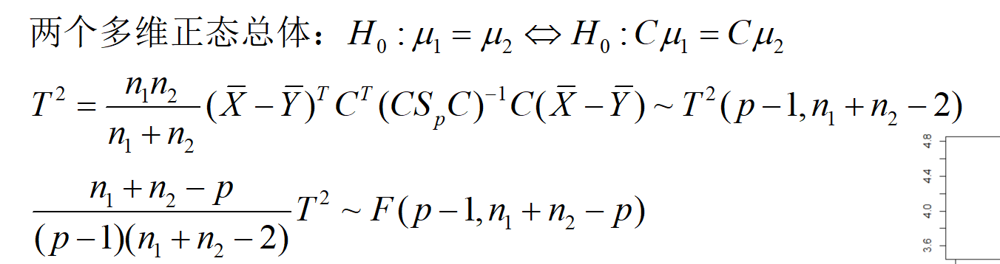

# 多元正态分布的统计推断

#### 以正态分布N(10,4)为例，生成40个随机数，求上述两种情况下均值的置信度为95%的置信区间。



``` R
mu=10
sigma=2
set.seed=123
x=rnorm(40,mu,sigma)
conf=0.95
mx=mean(x);  sdx=sd(x); 
2*(1-pnorm(abs(mx-mu)*sqrt(n)/sigma))
----
[1] 0.6485353
```

#### 分别以正态分布N(10,4),N(5,4)为例，各生成20个和30个随机数，求上述两种情况下均值差的置信度为95%的置信区间。



``` R
mu1=10; mu2=5;
sigma=2; conf=0.95; 
m=20; n=30; 
set.seed(100);
x=rnorm(m,mu1,sigma); y=rnorm(n,mu2,sigma); 
mx1=mean(x); my1=mean(y);
varx=var(x); vary=var(y); 
qua=qnorm((1+conf)/2);  qta=qt((1+conf)/2,m+n-2);  
c(mx1-my1-qua*sqrt(sigma^2/m+sigma^2/n),mx1-my1+qua*sqrt(sigma^2/m+sigma^2/n))
Sp=sqrt(((m-1)*varx+(n-1)*vary)/(m+n-2))*sqrt(1/m+1/n)
c(mx1-my1-qta*Sp,mx1-my1+qta*Sp)            # t.test(x,y,var.equal=T) 可得到相同结果
```

`qnorm`用来计算正态分布的分位数

#### 生成N(0,1) 随机数200，随机分成4组，执行4组之间的均差比较检验



``` R
x=rnorm(200,0,1)
x=data.frame(x=rnorm(200),y=as.factor(sample(1:4,200,replace=TRUE)))
mx=mean(x[,1]);  mxs=by(x[,1],x[,2],mean);  
ns=table(x[,2]);  K=length(ns);  n=nrow(x)
(St=sum((x[,1]-mx)^2));  (Sr=sum((mxs-mx)^2*ns)); (Se=St-Sr);
[1] 205.4605
[1] 2.183163
[1] 203.2773
(F=Sr/(K-1)/(Se/(n-K))); (p.value=1-pf(F,K-1,n-K)); 
[1] 0.7016686
[1] 0.5520933
summary(aov(x~y,data=x));
             Df Sum Sq Mean Sq F value Pr(>F)
y             3   2.18  0.7277   0.702  0.552
Residuals   196 203.28  1.0371 
```

#### 教材例4.2.1(应用多元统计)



``` R
u0=c(90,58,16);
dat=matrix(c(78,76,92,81,81,84,60.6,58.1,63.2,59.0,60.8,59.5,16.5,12.5,14.5,14.0,15.5,14.0),ncol=3,byrow=FALSE)
HotellingsT2(dat, mu = c(172,65,82), test = "chi")

        Hotelling's one sample T2-test

data:  dat
T.2 = 70095, df = 3, p-value < 2.2e-16
alternative hypothesis: true location is not equal to c(172,65,82)
```

也可以用

``` R
mx=apply(dat,2,mean);   vx=var(dat);  n=nrow(dat);  p=ncol(dat);
T2=n*t(mx-u0)%*%solve(vx)%*%(mx-u0)
p.value=1-pf((n-p)*T2/(p*(n-1)),p,n-p)
```

#### 教材例4.3.1(应用多元统计)



``` r
dat=matrix(c(78,76,92,81,81,84,60.6,58.1,63.2,59.0,60.8,59.5,16.5,      12.5,14.5,14.0,15.5,14.0),ncol=3,byrow=FALSE)
dat2=matrix(c(80,75,78,75,79,78,75,64,80,58.4,59.2,60.3,57.4,59.5,58.1,58.0,55.5,59.2,14.0,15.0,15.0,13.0,14.0,14.5,12.5,11.0,12.5),ncol=3,byrow=FALSE)
mx=apply(dat,2,mean);   vx=var(dat);  n1=nrow(dat);  p=ncol(dat);
my=apply(dat2,2,mean);  vy=var(dat2); n2=nrow(dat2);
sp=((n1-1)*vx+(n2-1)*vy)/(n1+n2-2)
T2=(n1*n2)/(n1+n2)*t(mx-my)%*%solve(sp)%*%(mx-my)
p.value=1-pf((n1+n2-p-1)*T2/(p*(n1+n2-2)),p,n1+n2-2)
```

这个方法似乎很好，但是要是能用别人的包那就很方便了

刚好有个包**ICSPN**，里面有个Hotelling函数可以用,只需要对数据做亿丁丁的处理就行

``` R
dat=matrix(c(78,76,92,81,81,84,60.6,58.1,63.2,59.0,60.8,59.5,16.5,      12.5,14.5,14.0,15.5,14.0),ncol=3,byrow=FALSE)
dat2=matrix(c(80,75,78,75,79,78,75,64,80,58.4,59.2,60.3,57.4,59.5,58.1,58.0,55.5,59.2,14.0,15.0,15.0,13.0,14.0,14.5,12.5,11.0,12.5),ncol=3,byrow=FALSE)
dat=as.data.frame(dat)
colnames(dat)=c('x1','x2','x3')
dat2=as.data.frame(dat2)
colnames(dat2)=c('x1','x2','x3')
cdat=rbind(dat,dat2)
cdat$y=c(rep(1,each=6),rep(2,each=9))
HotellingsT2(cbind(cdat$x1,cdat$x2,cdat$x3)~cdat$y)
----
        Hotelling's two sample T2-test

data:  cbind(cdat$x1, cdat$x2, cdat$x3) by cdat$y
T.2 = 1.4982, df1 = 3, df2 = 11, p-value =
0.2693
alternative hypothesis: true location difference is not equal to c(0,0,0)
```

#### 轮廓分析

其实存在三个问题：

1. 两轮廓外观是相似的吗？或者说二者是否平行？
2. 假如两轮廓是平行，那它们重合吗？
3. 假如两轮廓重合，那它们是水平的吗？



**推荐看应用多元统计的P100页**

数据放文末

``` R
#检验平行
C=matrix(c(-1,0,0,1,-1,0,0,1,-1,0,0,1),nrow=3,ncol=4)
mx=apply(d1,2,mean);  my=apply(d2,2,mean)
vx=var(d1); vy=var(d2); n1=nrow(d1); n2=nrow(d2); p=ncol(d1)
sp=((n1-1)*vx+(n2-1)*vy)/(n1+n2-2)
T2=n1*n2/(n1+n2)*t(C*(mx-my))%*%solve(C%*%sp%*%t(C))%*%(C%*%(mx-my))
p.value=1-pf((n1+n2-p)*T2/((p-1)*(n1+n2-2)),p-1,n1+n2-p)  #p.value=0.06255945
#检验重合
one=rep(1,p)
T2=n1*n2/(n1+n2)*sum(mx-my)^2/(t(one)%*%sp%*%one)    #T2=1.532
(p.value=1-pf(T2,1,n1+n2-2))   #p.value=0.22068
#检验水平
C=matrix(c(1,1,1,-1,0,0,0,-1,0,0,0,-1),nrow=3,ncol=4)
mz=n1*mx/(n1+n2)+n2*my/(n1+n2);  S=var(rbind(d1,d2))
T2=(n1+n2)*t(mz)%*%t(C)%*%solve(C%*%S%*%t(C))%*%(C%*%mz)  # 24.82071
(p.value=1-pf((n1+n2-p+1)*T2/((p-1)*(n1+n2-1)),p-1,n1+n2-p+1))  #0.0001554491
```

想找比较快的方法

#### 多个多维正态均值的比较检验

**应用多元统计的P107页**

``` R
d1=read.table('clipboard',header=TRUE); 
d2=read.table('clipboard',header=TRUE); 
d3=read.table('clipboard',header=TRUE); 
n1=nrow(d1);  p=ncol(d1);  K=3; n2=nrow(d2);  n3=nrow(d3);  n=n1+n2+n3;
mx1=apply(d1,2,mean);  mx2=apply(d2,2,mean);  mx3=apply(d3,2,mean)
mx=(n1*mx1+n2*mx2+n3*mx3)/n;  v1=var(d1); v2=var(d2); v3=var(d3);
E=(n1-1)*v1+(n2-1)*v2+(n3-1)*v3
H=n1*(mx1-mx)%*%t(mx1-mx)+n2*(mx2-mx)%*%t(mx2-mx)+n3*(mx3-mx)%*%t(mx3-mx)
T=E+H
wilks=det(E)/det(T);  
(F=(n-K-p+1)*(1-sqrt(wilks))/(p*sqrt(wilks)))
p.value=1-pf(F,2*p,2*(n-K-p+1))   #0.0040 估计认为三种销售方式的销售额有显著差异。
#检验哪种商品引起销售方式的显著差异,实施一元方差分析
F=numeric(4);  for(i in 1:4){ F[i]=H[i,i]/(K-1)/(E[i,i]/(n-K)); 
  print(1-pf(F[i],K-1,n-K)); }  #可知丁商品会导致销售方式的差异显著，剔除丁再从头检验
```


-----


| 丈夫对妻子 |      |      |      | 妻子对丈夫 |      |      |      |
| ---------- | ---- | ---- | ---- | ---------- | ---- | ---- | ---- |
| x1         | x2   | x3   | x4   | x1         | x2   | x3   | x4   |
| 2          | 3    | 5    | 5    | 4          | 4    | 5    | 5    |
| 5          | 5    | 4    | 4    | 4          | 5    | 5    | 5    |
| 4          | 5    | 5    | 5    | 4          | 4    | 5    | 5    |
| 4          | 3    | 4    | 4    | 4          | 5    | 5    | 5    |
| 3          | 3    | 5    | 5    | 4          | 4    | 5    | 5    |
| 3          | 3    | 4    | 5    | 3          | 3    | 4    | 4    |
| 3          | 4    | 4    | 4    | 4          | 3    | 5    | 4    |
| 4          | 4    | 5    | 5    | 3          | 4    | 5    | 5    |
| 4          | 5    | 5    | 5    | 4          | 4    | 5    | 4    |
| 4          | 4    | 3    | 3    | 3          | 4    | 4    | 4    |
| 4          | 4    | 5    | 5    | 4          | 5    | 5    | 5    |
| 5          | 5    | 4    | 4    | 5          | 5    | 5    | 5    |
| 4          | 4    | 4    | 4    | 4          | 4    | 5    | 5    |
| 4          | 3    | 5    | 5    | 4          | 4    | 4    | 4    |
| 4          | 4    | 5    | 5    | 4          | 4    | 5    | 5    |
| 3          | 3    | 4    | 5    | 3          | 4    | 4    | 4    |
| 4          | 5    | 4    | 4    | 5          | 5    | 5    | 5    |
| 5          | 5    | 5    | 5    | 4          | 5    | 4    | 4    |
| 5          | 5    | 4    | 4    | 3          | 4    | 4    | 4    |
| 4          | 4    | 4    | 4    | 5          | 3    | 4    | 4    |
| 4          | 4    | 4    | 4    | 5          | 3    | 4    | 4    |
| 4          | 4    | 4    | 4    | 4          | 5    | 4    | 4    |
| 3          | 4    | 5    | 5    | 2          | 5    | 5    | 5    |
| 5          | 3    | 5    | 5    | 3          | 4    | 5    | 5    |
| 5          | 5    | 3    | 3    | 4          | 3    | 5    | 5    |
| 3          | 3    | 4    | 4    | 4          | 4    | 4    | 4    |
| 4          | 4    | 4    | 4    | 4          | 4    | 5    | 5    |
| 3          | 3    | 5    | 5    | 3          | 4    | 4    | 4    |
| 4          | 4    | 3    | 3    | 4          | 4    | 5    | 4    |
| 4          | 4    | 5    | 5    | 4          | 4    | 5    | 5    |