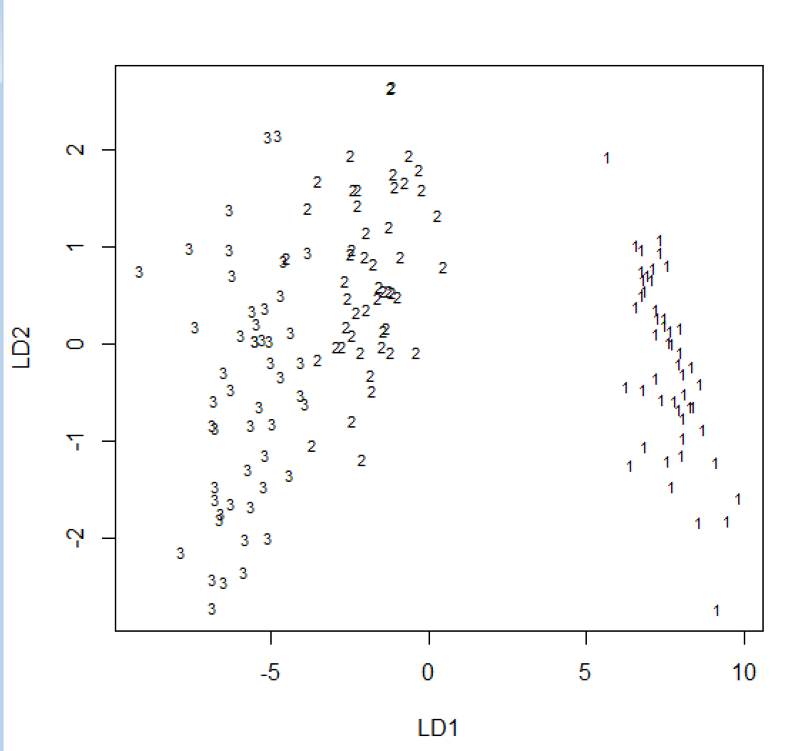

# Iris(判别分析)

#### 正态性与差异性展示

#####   查看每个自变量的正态性；相关性；数字特征差异性；每类的多维正态性；三个类的方差齐性等。


```R
> shapiro.test(dat$x1)

        Shapiro-Wilk normality test

data:  dat$x1
W = 0.97609, p-value = 0.01018

> shapiro.test(dat$x2)

        Shapiro-Wilk normality test

data:  dat$x2
W = 0.98492, p-value = 0.1012

> shapiro.test(dat$x3)

        Shapiro-Wilk normality test

data:  dat$x3
W = 0.87627, p-value = 7.412e-10

> shapiro.test(dat$x4)

        Shapiro-Wilk normality test

data:  dat$x4
W = 0.90183, p-value = 1.68e-08

```

可以看到除了x2，其他都不大可能是正态分布

``` R
cor(dat[,1:4])
           x1         x2         x3         x4
x1  1.0000000 -0.1175698  0.8717538  0.8179411
x2 -0.1175698  1.0000000 -0.4284401 -0.3661259
x3  0.8717538 -0.4284401  1.0000000  0.9628654
x4  0.8179411 -0.3661259  0.9628654  1.0000000
```

x1,x3,x4之间的相关性较大，可能存在一定的相互影响

``` R
plot(dat)
```


#### 距离判别

##### 因为欧氏距离未能将变量的相关性考虑进去，所以通常用马氏距离

``` R
distinguish.distance <- function(TrnX,TrnG,TstX=NULL,var.equal=FALSE){
  if (is.factor(TrnG) == FALSE){
    mx <- nrow(TrnX); mg <- nrow(TrnG)
    TrnX <- rbind(TrnX, TrnG)
    TrnG <- factor(rep(1:2,c(mx,mg)))  # 1重复mx遍，2重复mg遍
  }
  if (is.null(TstX) == TRUE) TstX <- TrnX
  if (is.vector(TstX) == TRUE) 
    TstX <-t(as.matrix(TstX))
  else if (is.matrix(TstX) != TRUE)
    TstX <- as.matrix(TstX)
  if (is.matrix(TrnX) != TRUE)
    TrnX <- as.matrix(TrnX)
  
  nx <- nrow(TstX)
  # blong用于存放预测值
  blong <- matrix(rep(0,nx),nrow=1,dimnames=list("blong",1:nx))
  g <- length(levels((TrnG)))    # 计算群体类别个数
  mu <- matrix(0,nrow=g,ncol=ncol(TrnX))
  # 每一个群体都有一个均值
  for(i in 1:g)   
    mu[i,] <- colMeans(TrnX[TrnG == i,])
  print(mu)
  # 计算马氏距离
  D <- matrix(0,nrow=g,ncol=nx)
  if (var.equal == TRUE || var.equal == T){
    for (i in 1:g)    # 样本到每一个类别的马氏距离
      D[i,] <- mahalanobis(TstX,mu[i,],var(TrnX))  # 混合样本方差
  }
  
  else{
    for (i in 1:g)
      D[i,] <- mahalanobis(TstX, mu[i,],var(TrnX[TrnG == i,]))
  }
  print(D)
  for (j in 1:nx){   # 分别判别每一个样本属于哪一个类别
    dmin <- Inf
    for (i in 1:g){    # 遍历每一个类别，找出最小距离
      if (D[i,j] < dmin){
        dmin <- D[i,j];
        blong[j] <- i
      }
    }
  }
  blong
}
result=distinguish.distance(dat[,1:4],g)
newg=result[1:length(result)]
table(g,newg)
---
   newg
g    1  2  3
  1 50  0  0
  2  0 47  3
  3  0  0 50

```

还没想好，后面再看看

现在是用前人的智慧了，引用于[^1],这个是马氏距离判别可以看出判别的准度很好

#### 贝叶斯判别

##### 协方差阵相等的Bayes判别

``` R
library(MASS)
attach(dat)
ld=lda(g~x1+x2+x3+x4,prior=c(1,1,1)/3)
table(g,predict(ld)$class)
g    1  2  3
  1 50  0  0
  2  0 48  2
  3  0  1 49
Z=predict(ld1)
cbind(my.iris$g,round(Z$posterior,3),Z$class) #看分类细节
table(my.iris$g,Z$class)  #混淆矩阵
prop.table(table(my.iris$g,Z$class),1)  #正确率
g      1    2    3
  1 1.00 0.00 0.00
  2 0.00 0.96 0.04
  3 0.00 0.02 0.98
```

##### 协方差阵不相等的Bayes判别

``` R
pd=qda(g~x1+x2+x3+x4,prior=c(1,1,1)/3)
Z=predict(pd)
cbind(g,round(Z$posterior,3),Z$class) #看分类细节
table(g,Z$class)  #混淆矩阵
------
g    1  2  3
  1 50  0  0
  2  0 48  2
  3  0  1 49
prop.table(table(g,Z$class),1)  #正确率
-----
g      1    2    3
  1 1.00 0.00 0.00
  2 0.00 0.96 0.04
  3 0.00 0.02 0.98
```

加入要用交叉检验法，得这样做

``` R
ld3=qda(g~x1+x2+x3+x4,data=my.iris,prior=c(1,1,1)/3,CV=TRUE)
```

#### Fisher判别法

``` R
n=dim(dat)[1]
k=3
ld=lda(g~x1+x2+x3+x4,dat)
ev=ld$svd^2*(k-1)/(n-k)
round(ev,3)
prop=ev/sum(ev)
round(prop,4)
round(cumsum(prop),4)
round(ld$scalling,3)
Z=predict(ld)
round(Z$x,3)
plot(Z$x,cex=0)
text(Z$x[,1],Z$x[,2],cex=0.7,g)
```




[^1]:https://blog.csdn.net/qq_41196612/article/details/105339511
