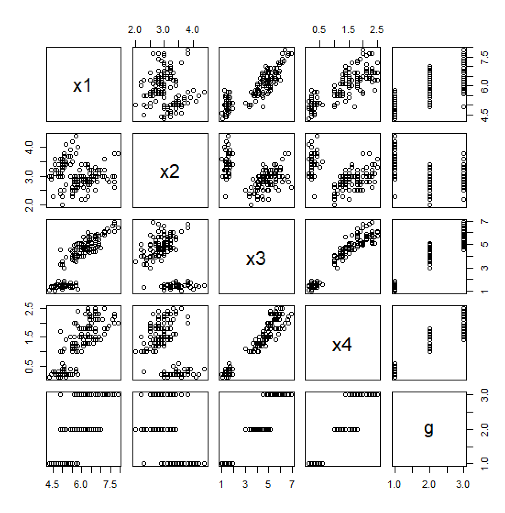

# Iris(判别分析)

#### 正态性与差异性展示

#####   查看每个自变量的正态性；相关性；数字特征差异性；每类的多维正态性；三个类的方差齐性等。


```R
> shapiro.test(dat$x1)

        Shapiro-Wilk normality test

data:  dat$x1
W = 0.97609, p-value = 0.01018

> shapiro.test(dat$x2)

        Shapiro-Wilk normality test

data:  dat$x2
W = 0.98492, p-value = 0.1012

> shapiro.test(dat$x3)

        Shapiro-Wilk normality test

data:  dat$x3
W = 0.87627, p-value = 7.412e-10

> shapiro.test(dat$x4)

        Shapiro-Wilk normality test

data:  dat$x4
W = 0.90183, p-value = 1.68e-08

```

可以看到除了x2，其他都不大可能是正态分布

``` R
cor(dat[,1:4])
           x1         x2         x3         x4
x1  1.0000000 -0.1175698  0.8717538  0.8179411
x2 -0.1175698  1.0000000 -0.4284401 -0.3661259
x3  0.8717538 -0.4284401  1.0000000  0.9628654
x4  0.8179411 -0.3661259  0.9628654  1.0000000
```

x1,x3,x4之间的相关性较大，可能存在一定的相互影响

``` R
plot(dat)
```




#### 距离判别

```R
library(MASS)
pd=qda(g~x1+x2+x3+x4)
table(g,predict(pd)$class)

g    1  2  3
  1 50  0  0
  2  0 48  2
  3  0  1 49

```

