# 福州某大学模拟卷

### 第一题

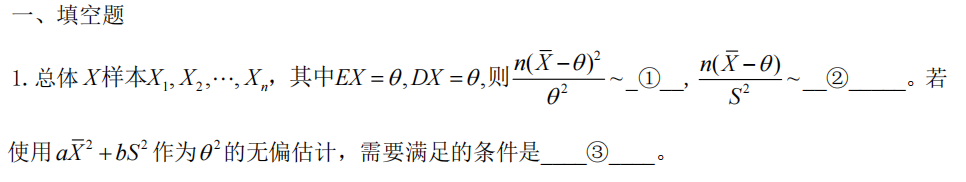

由题意已知：$\overline X=\frac {1}{n}\sum_{i=1}^n X_i $，根据中心极限定理，当n充分大的时，

$$\frac{\overline X-E(X)}{\frac{D(X)}{\sqrt n} } \sim N(0,1)$$

则:$\frac{n(\overline X-\theta)}{\theta ^2} \sim \chi^2(1)$

由$Z\sim N(0,1)$，$Y\sim \chi ^2(m)$，且二者相互独立，则$T=\frac{Z}{\sqrt{\frac{Y}{m}}}\sim t(m)$

则：$\frac {n(\overline X-\theta)}{S^2}\sim t(n-1)$

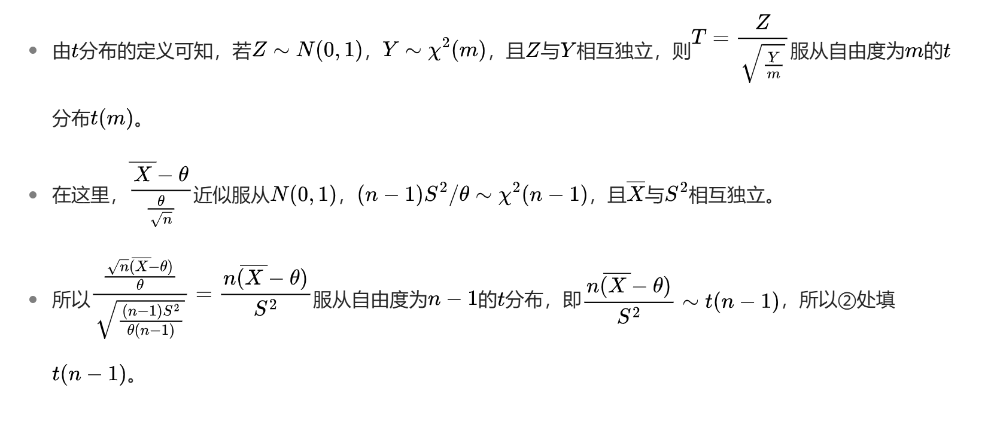

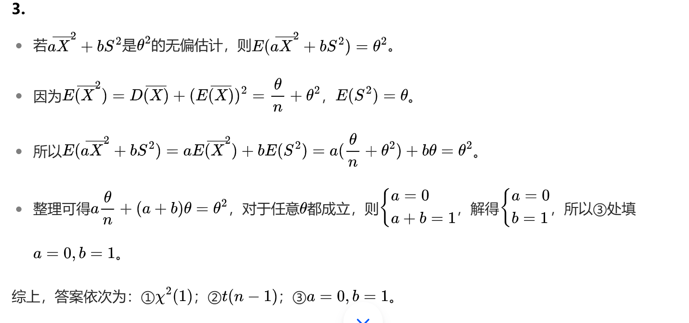

  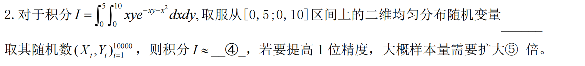

二维分布的概率密度函数为$f(x,y)=\frac{1}{5\times 10}=\frac{1}{50}$

``` R
N=10000;x=runif(N,0,5);y=runif(N,0,10)
f <- function(x, y) {return(x * y * exp(-x * y - x^2))}
v=f(x,y)
summary(v)
mean(v)*50
[1] 1.703806

install.packages("pracma")
library(pracma)
# 使用integral2函数进行数值积分
result <- integral2(f, 0, 5, 0, 10)
print(result)

$Q
[1] 1.619792

$error
[1] 1.267658e-07
```

当N等于100000的时候，结果为`[1] 1.603132`

使用卡特蒙罗方法，$Error\propto \frac{1}{\sqrt n}$，**提高一位精度，就是误差量变为原来十分之一，依据样本量扩大100倍关系**

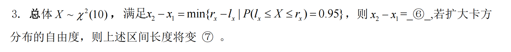

``` R
-qchisq(0.025, 10)+qchisq(0.975,10)
[1] 17.2362
for (i in 10:20) print(-qchisq(0.025, i)+qchisq(0.975,i))
[1] 17.2362
[1] 18.1043
[1] 18.93288
[1] 19.72685
[1] 20.49022
[1] 21.22626
[1] 21.93769
[1] 22.62682
[1] 23.29563
[1] 23.94581
[1] 24.57883
```

变长

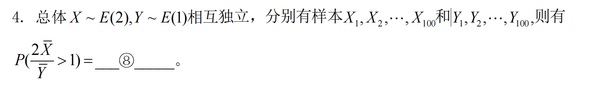

``` R
N=100000
x=rexp(N,2);y=rexp(N,1);
p=0
n=1000
for(i in 1:n)
{	x1=sample(x,100);y1=sample(y,100);mx=mean(x1);my=mean(y1)
if((2*mx/my)>1) p=p+1
}
p=p/n
p
[1] 0.4964955

```

进行多次可以看出来$P(\frac{2\overline X}{\overline Y}> 1)=0.5$

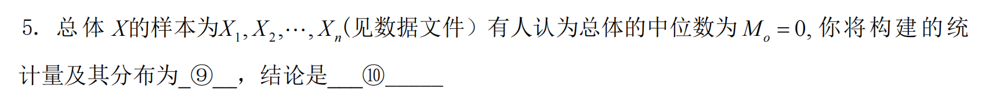

没数据

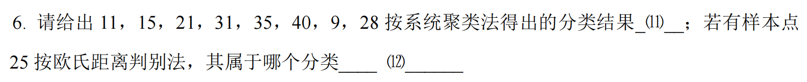

``` R
x=c(11,15,21,31,35,40,9,28)
d=dist(x,method='euclidean')
op=par(mfrow=c(2,4))
methods=c("ward.D","ward.D2","single","complete","average","mcquitty","median","centroid")
for(i in 1:8){ hc=hclust(d,method=methods[i]); plot(hc,hang=-1,main='') }
```

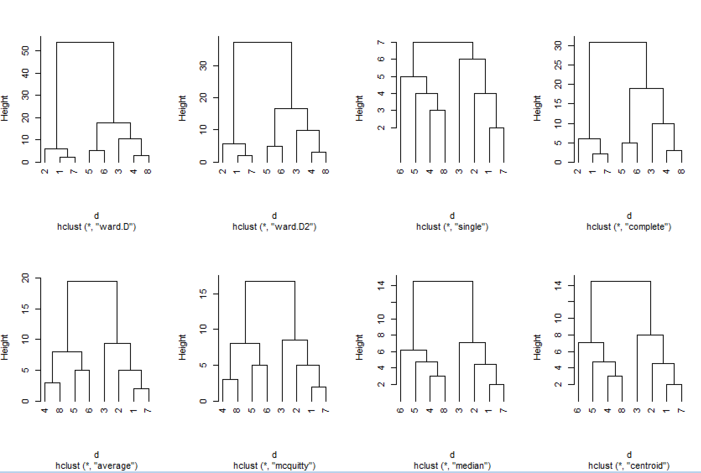

加入25后，具体得看他分为几类

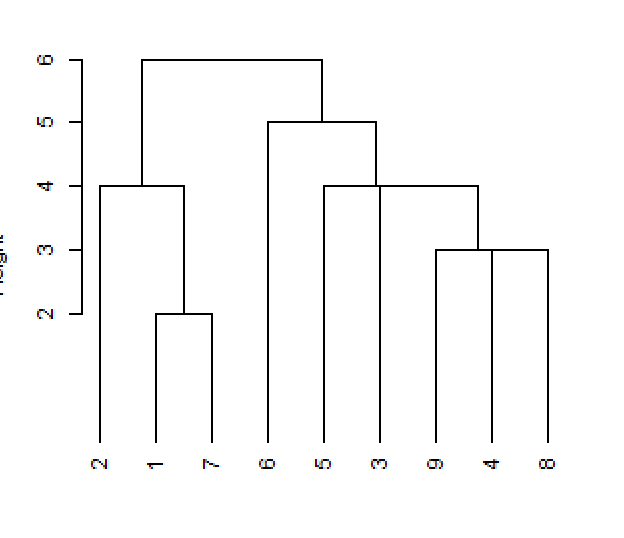

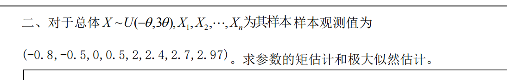

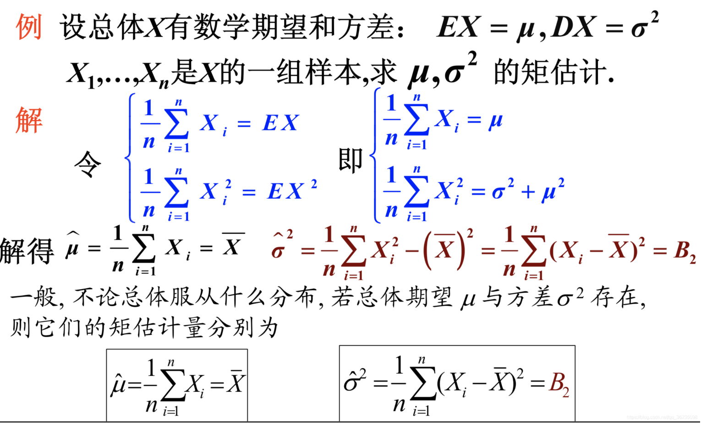

``` R
x=c(-0.8,-0.5,0,0.5,2,2.4,2.7,2.97)
#矩估计
> mean(x)
[1] 1.15875
> var(x)
[1] 2.324184

> max(-x)
[1] 0.8
> max(1/3*x)
[1] 0.99
```

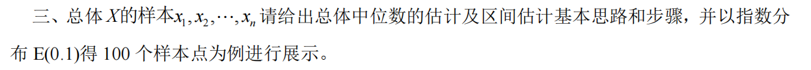

``` R
x=rexp(100000,0.1)
r=c()
for(i in 1:10000)
{	x1=sample(x,100)
	r=c(r,median(x1))
}
median(x)
r=sort(r)
result=cbind(r[250],r[9750])

         [,1]     [,2]
[1,] 5.189927 9.004251

```

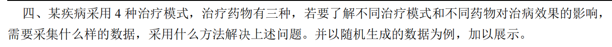

看看ai吧

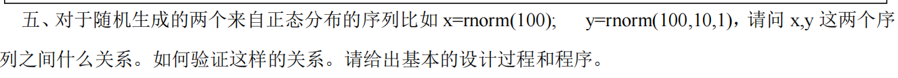

``` R
> x=rnorm(100);y=rnorm(100,10,1)
> summary(x)
    Min.  1st Qu.   Median     Mean  3rd Qu.     Max. 
-2.71140 -0.57888  0.07429  0.04050  0.71046  2.13168 
> summary(y)
   Min. 1st Qu.  Median    Mean 3rd Qu.    Max. 
  6.699   9.247   9.926   9.902  10.489  12.518 
> 
> summary((y-10)/1)
    Min.  1st Qu.   Median     Mean  3rd Qu.     Max. 
-3.30145 -0.75321 -0.07436 -0.09766  0.48866  2.51844 

```

**t检验**

``` R
x1=y-10
m=matrix(c(x,x1),nrow=100)
t.test(x,x1)

        Welch Two Sample t-test

data:  x and x1
t = -0.30265, df = 195, p-value = 0.7625
alternative hypothesis: true difference in means is not equal to 0
95 percent confidence interval:
 -0.3273849  0.2402745
sample estimates:
  mean of x   mean of y 
-0.05705544 -0.01350026 
```

方差大于0.05，说明不存在显著差异，构造t统计量

无需多言，显而易见可以看出来$\frac {y-10}{1} \sim N(0,1)$

[使用R语言进行卡方检验（chi-square test） - 知乎](https://zhuanlan.zhihu.com/p/42803826)

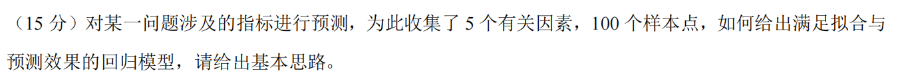

看看ai

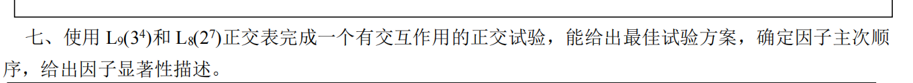

这个参考[这个](./../11/方差分析与正交试验.md)

[最简单的正交试验教程，一次搞定它！ - 知乎](https://zhuanlan.zhihu.com/p/157883678)

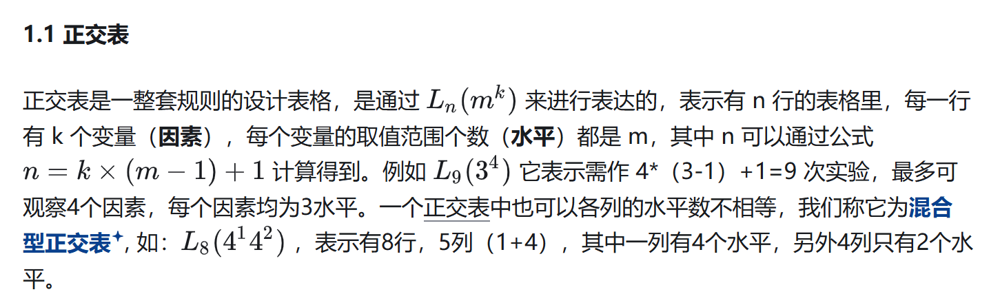

[正交试验设计及分析（多实现途径） - 知乎](https://zhuanlan.zhihu.com/p/294820345)

里面有方差分析

$总体\sim F(x,\theta),X_1,X_2,...,X_n为其样本，EX=\theta,DX=2\theta,则\frac{\sqrt n (\overline X -\theta)}{S}\sim ?,得到该结论的依据是？若使用a\overline X+bS^2作为\theta 的无偏估计，应满足？$

$总体X\sim N(100,0.5^2),Y\sim E(1)相互独立，分别取1000个样本，则2000(2(\overline X -10)^2+\overline Y)\sim ?$

总体$X\sim F(x,\theta),x_1,x_2,...,x_n为其样本，已知\theta^2=DX，请给出\theta ^2$的估计及均方误差的表示，并给出估计该均方误差的简要思路和估计值

总体$X\sim f(x,u,\theta)=\frac{1}{2\sigma} e^{- \frac{|x-u|}{\sigma}},u\in R,\sigma>0,x_1,x_2,...,x_n为其样本，$求u和$\sigma$的最大似然估计量及估计值

某产品的产量取决于A，B，C三个因素以及可能存在的两两交互的作用。为简化分析过程每个因素取两个水平，依次试验结果为（65,73,73,75,70,74,60,71）

|       | A    | B    | C    |
| ----- | ---- | ---- | ---- |
| 水平1 | 60   | 1.2  | 20%  |
| 水平2 | 80   | 1.5  | 30%  |

给出提升产品产量的最佳方案

总体X的样本为X1,X2,...,Xn，有人觉得总体的中位数为M0=0，怎么构建统计量及其分布

对于两个连续的总体X，Y，观测配对样本$(x_i,y_i)^2_{i=1}$，应如何处理预数据，然后选择什么方法来分析两个总体的独立性，给出解决问题的基本思路和结论
