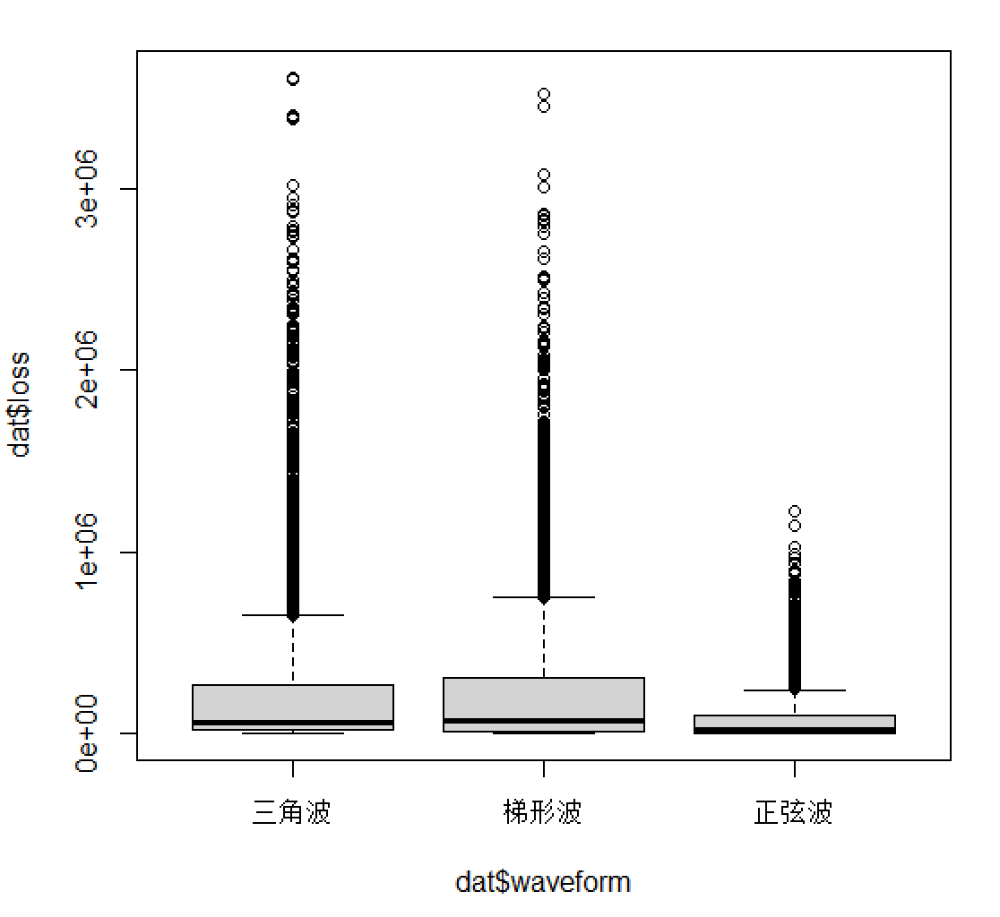
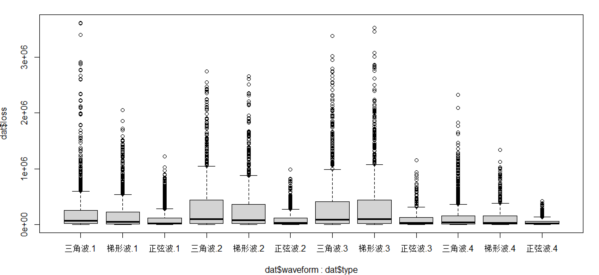
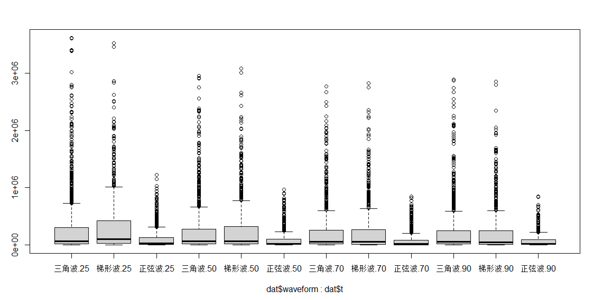
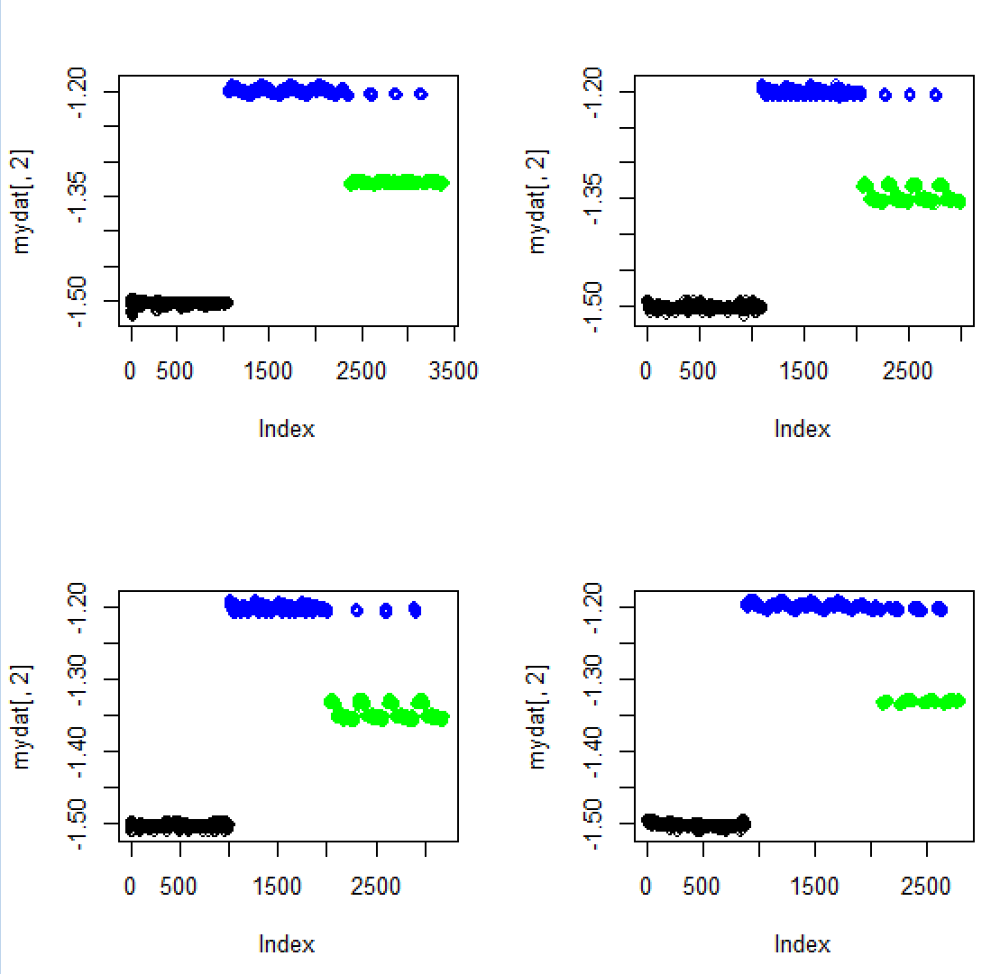
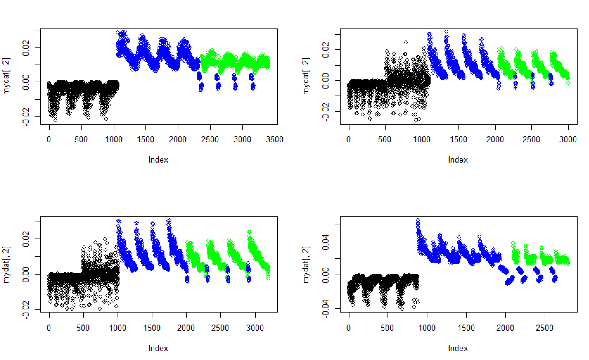
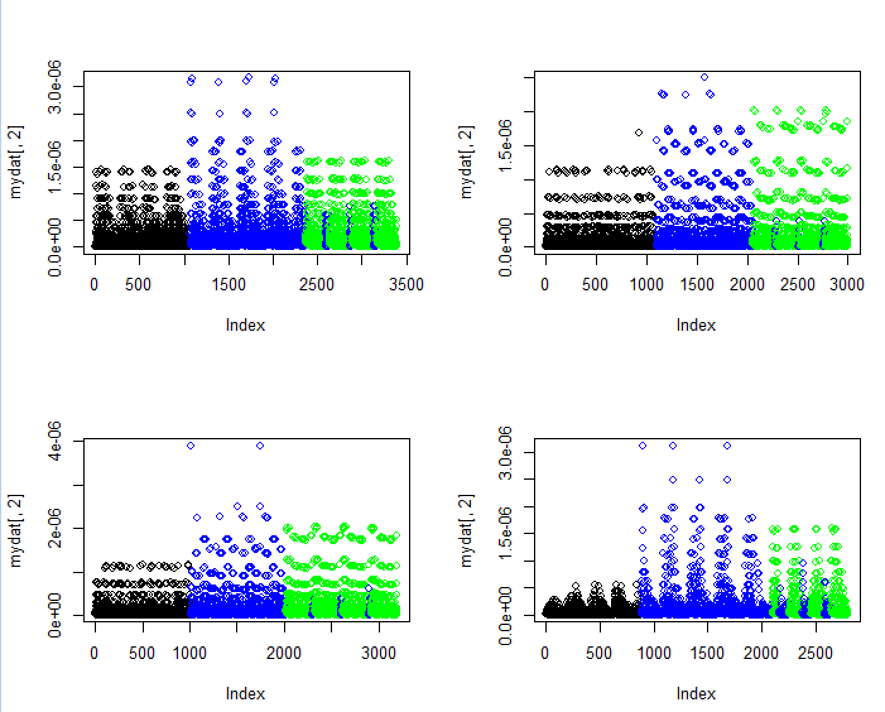

# 2024年华为杯中国研究生数学建模竞赛C题

#### 数据构成：

**附件1(100多兆)**为训练集，有 4 个数据表，分别表示来自 4 种不同磁芯材料所测的数据（由于磁芯材料的复杂性，仅用材料1、材料2、材料3、材料4来表示不同材料），4个数据表结构相同，其中：

- 第1列是温度，取4个值：25、50、70、90，单位：摄氏度
- 第2列是频率，取值范围：50000—500000，单位：赫兹Hz
- 第3列是磁芯损耗，单位：每立方米瓦特（W/m3）；
- 第4列是励磁波形类型：正弦波、三角波和梯形波；第5—1029列是磁通密度，共1024个采样点（一个周期时间内，相同间距采样），单位：特斯拉（T）；
- 每一行表示磁芯在一种工况下的实验结果，不同行表示不同的工况.

#### 导入数据

因为样本数据量太大了，一般导入在R语言里有点难，所以推荐用excel打开文件，`clipboard`复制粘贴进去

``` R
dat=read.table('clipboard',header=FALSE)
colnames(dat)=c('t',)dat=read.table("clipboard",header=FALSE)
colnames(dat)=c('t','freq','loss','waveform',1:1024)
newdat=read.table("clipboard",header=FALSE)
colnames(newdat)=c('t','freq','loss','waveform',1:1024)
dat <- rbind(dat, newdat)
```

对数据稍微做下处理，用type来区分材料的类型

``` R
n_rows <- 3400 + 3000 + 3200 + 2800
type_vec <- rep(0, n_rows)

# 分段赋值
type_vec[1:3400] <- 1
type_vec[(3400 + 1):(3400 + 3000)] <- 2
type_vec[(3400 + 3000 + 1):(3400 + 3000 + 3200)] <- 3
type_vec[(3400 + 3000 + 3200 + 1):n_rows] <- 4

# 将向量赋值给dat$type列
dat$type <- type_vec
```

非常好

#### 提取出反映磁通密度分布及波形的形状特征变量

利用附件一中磁通密度数据，首先分析磁通密度的分布特征及不同波形的形状特征，提取出反映磁通密度分布及波形的形状特征变量；然后利用这些特征变量建立分类模型，识别出励磁的三种波形，分析分类模型的合理性及有效性。

``` R
table(dat$type)
------
   1    2    3    4 
3400 3000 3200 2800 
table(dat$t,dat$waveform)
----
     三角波 梯形波 正弦波
  25   1338    776   1130
  50   1215    856    999
  70   1195    871    964
  90   1200    895    961
```

查看材料不同类型的样本量以及总体的温度+波形统计，感觉信息有点少，那就查看不同type下温度+波形统计

``` R
table(dat[dat$type==1,'t'],dat[dat$type==1,'waveform'])
     三角波 梯形波 正弦波
  25    370    220    271
  50    357    232    256
  70    341    237    265
  90    344    232    275
 table(dat[dat$type==2,'t'],dat[dat$type==2,'waveform'])
     三角波 梯形波 正弦波
  25    244    216    353
  50    255    224    248
  70    252    233    261
  90    252    227    235
> table(dat[dat$type==3,'t'],dat[dat$type==3,'waveform'])   
     三角波 梯形波 正弦波
  25    279    277    294
  50    258    279    264
  70    260    277    217
  90    281    279    235
> table(dat[dat$type==4,'t'],dat[dat$type==4,'waveform'])  
     三角波 梯形波 正弦波
  25    445     63    212
  50    345    121    231
  70    342    124    221
  90    323    157    216
```

可以看出在type=1和type=4时，波形似乎与温度有较为明显的关系

``` R
prop.table(table(dat$waveform))
   三角波    梯形波    正弦波 
0.3990323 0.2740323 0.3269355 
```

每种波形的频率如上

``` R
boxplot(dat$loss~dat$waveform)
```




可以看出，看不出什么

那画下不同type下的每种波形的磁芯损耗比较呢

``` R
boxplot(dat$loss~dat$waveform+dat$type)
```



可以看出来，**无论是用哪种工艺正弦波的损耗都是明显低于另外两种波形的损耗**

#### 给出交叉组合条件的分布比较

##### 给出温度+波形组合条件下磁芯损耗的分布比较

``` R
boxplot(dat$loss~dat$waveform+dat$t)
```




##### 给出温度+波形组合条件下频率的分布比较

``` R
 prop.table(table(dat$waveform,dat$t))
        
                 25         50         70         90
  三角波 0.10790323 0.09798387 0.09637097 0.09677419
  梯形波 0.06258065 0.06903226 0.07024194 0.07217742
  正弦波 0.09112903 0.08056452 0.07774194 0.07750000
```

在t=25的前提下，梯形波与其他波形差异明显；而在t条件下，三角波与其他波形差异明显

#### 绘制每种工况条件下的磁通密度的曲线

##### 绘制材料1中正弦波对应的磁通密度曲线

不行了，画图不大会，现在去学下

还是不会

#### 由磁通密度曲线分布及及形状特征构造不同波形的分类指标

1. 尝试基本统计量指标：均值、标准差、方差、极差、极值、中位数、
2. 尝试胖瘦特征：峰度系数
3. 尝试对称特征：偏度系数
4. 尝试斜率特征：大步长一阶差分或其方差，二阶差分
5. 起始值与最高值构成直线，两者之间样本点与其偏差平方和(绝对值）的均值

``` R
par(mfrow=c(2,2))
cols=c('正弦波'='black','三角波'='blue','梯形波'='green');
for(i in 1:4){
k=apply(dat[dat$type==i,paste0(1:1024)],1,kurtosis)
mydat=data.frame(waveform=dat[dat$type==i,4],k=k)
plot(mydat[,2],col=cols[mydat[,1]])
}
```



尝试用峰度系数来划分，效果非常明显，在四种工艺下均能明显区分

``` R
par(mfrow=c(2,2))
for(i in 1:4){
k=apply(dat[dat$type==i,paste0(1:1024)],1,skewness)
mydat=data.frame(waveform=dat[dat$type==i,4],k=k)
plot(mydat[,2],col=cols[mydat[,1]])
}
```



用偏度系数来来划分，效果还行

``` R
par(mfrow=c(2,2))
for(i in 1:4){
k=apply(dat[dat$type==i,paste0(1:1024)],1,diff)
k=apply(k,2,var)
mydat=data.frame(waveform=dat[dat$type==i,4],k=k)
plot(mydat[,2],col=cols[mydat[,1]])
}
```




一阶差分方差看起来也不明显啊

