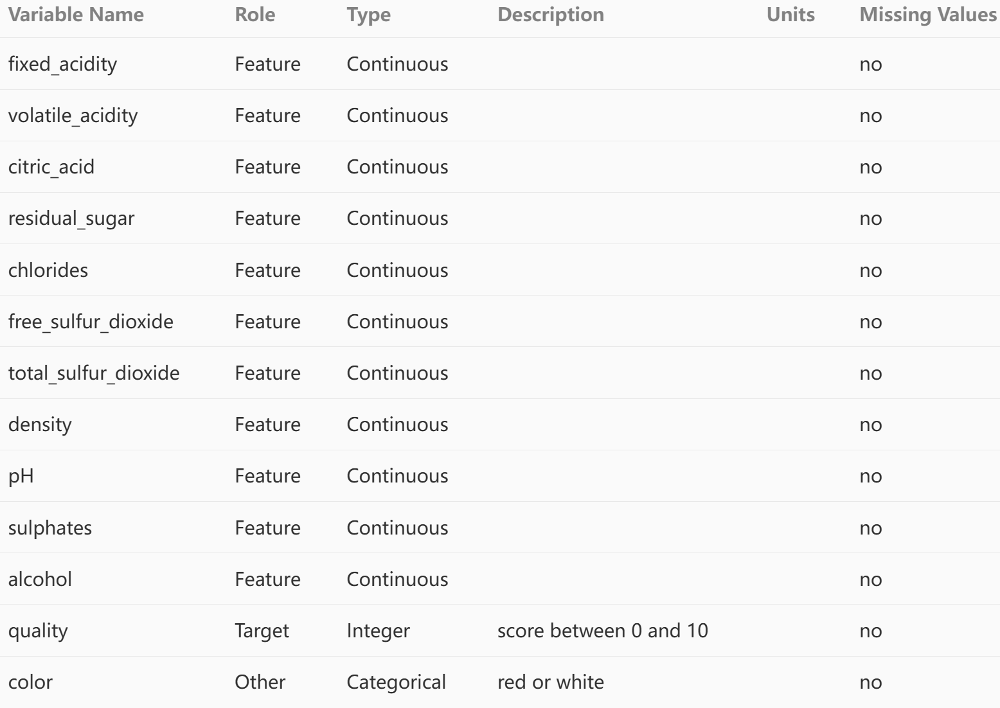
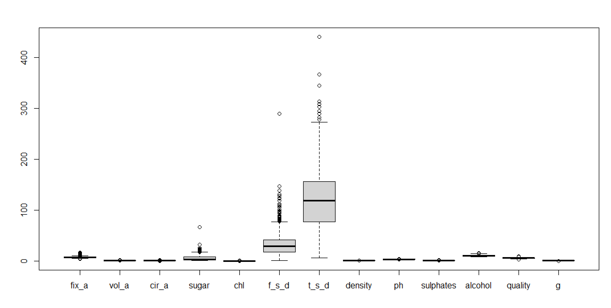
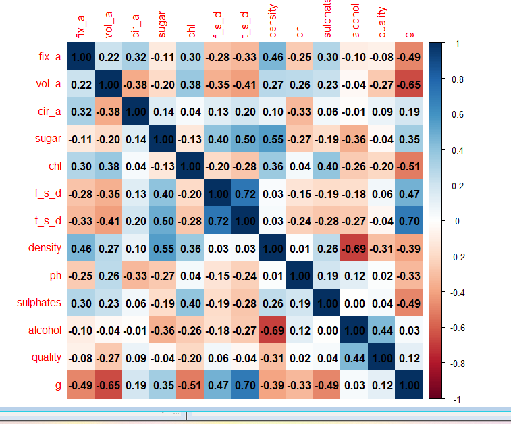
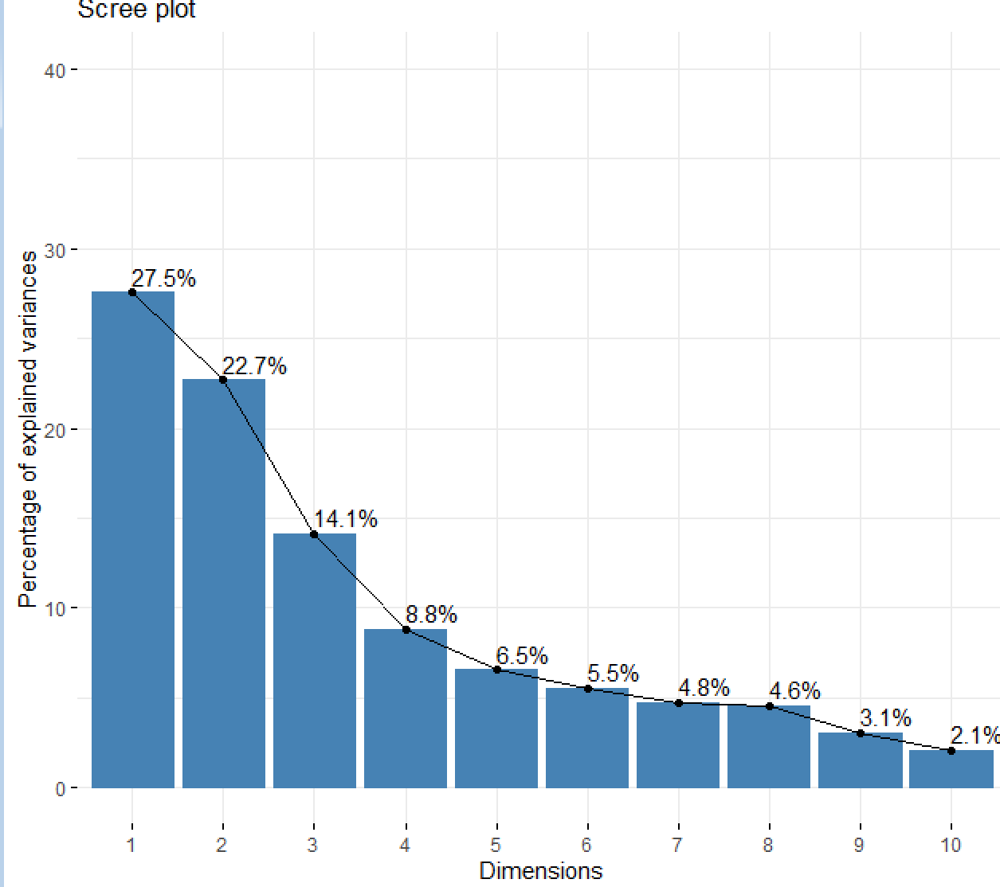

<div align = "center"><h1>实例：葡萄酒</h1></div>

### 数据来源

访问UCL机器学习资源网站，下载**Wine Quality数据集**，里面包括红葡萄酒和白葡萄酒的两个CSV文件，每个文件包括12格自变量和1个因变量，都是数值型。

数据组成如下：



#### 导入数据

将数据放在工作目录下，导入数据，检查是否存在数据缺失，对数据进行预处理。

``` R
dat=read.table("winequality-red.csv",sep=';',header=TRUE)
dat2=read.table("winequality-white.csv",sep=';',header=TRUE)

> dim(dat);dim(dat2);
[1] 1599   12
[1] 4898   12
```

dat表示为红葡萄酒数据集，dat2表示为白葡萄酒数据集；经过检查不存在数据缺失的情况，为方便操作，将两个数据集合在一起，并修改数据变量名，建立一个新的变量g，来区分红葡萄酒和白葡萄酒。

``` R
wdat=rbind(dat,dat2)
> head(wdat,1)
  fixed.acidity volatile.acidity citric.acid
1           7.4             0.70        0.00
  residual.sugar chlorides free.sulfur.dioxide
1            1.9     0.076                  11
  total.sulfur.dioxide density   pH sulphates alcohol
1                   34  0.9978 3.51      0.56     9.4
  quality
1       5
colnames(wdat)=c('fix_a','vol_a','cir_a','sugar','chl','f_s_d','t_s_d','density','ph','sulphates','alcohol','quality')
wdat$g=c(rep(0,1599),rep(1,4898))
> head(wdat,1)
  fix_a vol_a cir_a sugar   chl f_s_d t_s_d density
1   7.4   0.7     0   1.9 0.076    11    34  0.9978
    ph sulphates alcohol quality g
1 3.51      0.56     9.4       5 0
```

将各个数据重命名如上，当数据为红葡萄酒数据集时候，g=0；当数据为白葡萄酒数据集时候，g=1；

#### 对数据实施描述性统计分析，找出影响葡萄酒品质的主要因素

对数据进行描述性统计

``` R
> summary(wdat)
     fix_a            vol_a            cir_a            sugar             chl         
 Min.   : 3.800   Min.   :0.0800   Min.   :0.0000   Min.   : 0.600   Min.   :0.00900  
 1st Qu.: 6.400   1st Qu.:0.2300   1st Qu.:0.2500   1st Qu.: 1.800   1st Qu.:0.03800  
 Median : 7.000   Median :0.2900   Median :0.3100   Median : 3.000   Median :0.04700  
 Mean   : 7.215   Mean   :0.3397   Mean   :0.3186   Mean   : 5.443   Mean   :0.05603  
 3rd Qu.: 7.700   3rd Qu.:0.4000   3rd Qu.:0.3900   3rd Qu.: 8.100   3rd Qu.:0.06500  
 Max.   :15.900   Max.   :1.5800   Max.   :1.6600   Max.   :65.800   Max.   :0.61100  
     f_s_d            t_s_d          density             ph          sulphates     
 Min.   :  1.00   Min.   :  6.0   Min.   :0.9871   Min.   :2.720   Min.   :0.2200  
 1st Qu.: 17.00   1st Qu.: 77.0   1st Qu.:0.9923   1st Qu.:3.110   1st Qu.:0.4300  
 Median : 29.00   Median :118.0   Median :0.9949   Median :3.210   Median :0.5100  
 Mean   : 30.53   Mean   :115.7   Mean   :0.9947   Mean   :3.219   Mean   :0.5313  
 3rd Qu.: 41.00   3rd Qu.:156.0   3rd Qu.:0.9970   3rd Qu.:3.320   3rd Qu.:0.6000  
 Max.   :289.00   Max.   :440.0   Max.   :1.0390   Max.   :4.010   Max.   :2.0000  
    alcohol         quality            g         
 Min.   : 8.00   Min.   :3.000   Min.   :0.0000  
 1st Qu.: 9.50   1st Qu.:5.000   1st Qu.:1.0000  
 Median :10.30   Median :6.000   Median :1.0000  
 Mean   :10.49   Mean   :5.818   Mean   :0.7539  
 3rd Qu.:11.30   3rd Qu.:6.000   3rd Qu.:1.0000  
 Max.   :14.90   Max.   :9.000   Max.   :1.0000 
```

可以得到如上数据，可以进行绘图，以便提取到更多信息。

``` R
boxplot(wdat)
```



绘制箱型图可知，每个变量的波动情况以及集中程度不一，`f_s_d`和`t_s_d`的波动程度最大，可能存在显著影响。

``` R
corr=cor(wdat)
corrplot(corr,method='color',addCoef.col = 'black')
```




绘制热力图可知`vol_a`、`chl`、`density`、`alcohol`与`quality`的相关性很大，特别是`alcohol`的相关性系数达0.44

#### 构建葡萄酒质量的线性回归模型，并确定最优的回归模型

先做直接做回归

``` R
dat3=rbind(dat,dat2)
colnames(dat3)=c('fix_a','vol_a','cir_a','sugar','chl','f_s_d','t_s_d','density','ph','sulphates','alcohol','quality')
lm=lm(quality~.,dat3)
summary(lm)

Call:
lm(formula = quality ~ ., data = dat3)

Residuals:
    Min      1Q  Median      3Q     Max 
-3.7569 -0.4597 -0.0412  0.4694  2.9907 

Coefficients:
              Estimate Std. Error t value Pr(>|t|)    
(Intercept)  5.576e+01  1.189e+01   4.688 2.81e-06 ***
fix_a        6.768e-02  1.557e-02   4.346 1.41e-05 ***
vol_a       -1.328e+00  7.737e-02 -17.162  < 2e-16 ***
cir_a       -1.097e-01  7.962e-02  -1.377    0.168    
sugar        4.356e-02  5.156e-03   8.449  < 2e-16 ***
chl         -4.837e-01  3.327e-01  -1.454    0.146    
f_s_d        5.970e-03  7.511e-04   7.948 2.22e-15 ***
t_s_d       -2.481e-03  2.767e-04  -8.969  < 2e-16 ***
density     -5.497e+01  1.214e+01  -4.529 6.04e-06 ***
ph           4.393e-01  9.037e-02   4.861 1.20e-06 ***
sulphates    7.683e-01  7.612e-02  10.092  < 2e-16 ***
alcohol      2.670e-01  1.673e-02  15.963  < 2e-16 ***
---
Signif. codes:  0 ‘***’ 0.001 ‘**’ 0.01 ‘*’ 0.05 ‘.’ 0.1 ‘ ’ 1

Residual standard error: 0.7353 on 6485 degrees of freedom
Multiple R-squared:  0.2921,    Adjusted R-squared:  0.2909 
F-statistic: 243.3 on 11 and 6485 DF,  p-value: < 2.2e-16
```

可以看到除了`cir_a`与`chl`的p值小于0.05不显著外，其他变量均小于0.05，不过整个模型的相关系数只为0.2921。故采取逐步回归法。

``` R
lm.2=step(lm,direction="backward")
summary(lm.2)

Call:
lm(formula = quality ~ fix_a + vol_a + sugar + chl + f_s_d + 
    t_s_d + density + ph + sulphates + alcohol, data = dat3)

Residuals:
    Min      1Q  Median      3Q     Max 
-3.7408 -0.4614 -0.0380  0.4712  2.9885 

Coefficients:
              Estimate Std. Error t value Pr(>|t|)    
(Intercept)  5.594e+01  1.189e+01   4.703 2.61e-06 ***
fix_a        6.270e-02  1.515e-02   4.139 3.53e-05 ***
vol_a       -1.287e+00  7.144e-02 -18.014  < 2e-16 ***
sugar        4.340e-02  5.155e-03   8.420  < 2e-16 ***
chl         -5.550e-01  3.287e-01  -1.689   0.0913 .  
f_s_d        5.998e-03  7.509e-04   7.988 1.61e-15 ***
t_s_d       -2.546e-03  2.727e-04  -9.336  < 2e-16 ***
density     -5.515e+01  1.214e+01  -4.544 5.62e-06 ***
ph           4.481e-01  9.015e-02   4.971 6.83e-07 ***
sulphates    7.637e-01  7.606e-02  10.041  < 2e-16 ***
alcohol      2.649e-01  1.666e-02  15.903  < 2e-16 ***
---
Signif. codes:  0 ‘***’ 0.001 ‘**’ 0.01 ‘*’ 0.05 ‘.’ 0.1 ‘ ’ 1

Residual standard error: 0.7354 on 6486 degrees of freedom
Multiple R-squared:  0.2919,    Adjusted R-squared:  0.2908 
F-statistic: 267.4 on 10 and 6486 DF,  p-value: < 2.2e-16

```

向后逐步回归得当去掉`cir_a`时，整个回归模型AIC最小，`chl`在0.1的水平上显著，其他变量均在0.05水平上显著，相关系数变化不大。

所以构建的最优线性回归模型为：

$$\begin{align*} \text{quality} &= 55.94 + 0.0627 \times \text{fix\_a} - 1.287 \times \text{vol\_a} + 0.0434 \times \text{sugar} - 0.555 \times \text{chl} + 0.005998 \times \text{f\_s\_d} \\ &- 0.002546 \times \text{t\_s\_d} - 55.15 \times \text{density} + 0.4481 \times \text{ph} + 0.7637 \times \text{sulphates} + 0.2649 \times \text{alcohol} \end{align*}$$

#### 构建葡萄酒质量的机器学习模型

对数据进行PCA降维

```R
df<-dat3[,-12]
res.pca <- prcomp(df,scale. = T)
> get_eig(res.pca)
       eigenvalue variance.percent cumulative.variance.percent
Dim.1   3.0298686       27.5442604                    27.54426
Dim.2   2.4938260       22.6711457                    50.21541
Dim.3   1.5563470       14.1486087                    64.36401
Dim.4   0.9705521        8.8232007                    73.18722
Dim.5   0.7198749        6.5443174                    79.73153
Dim.6   0.6073117        5.5210156                    85.25255
Dim.7   0.5231588        4.7559888                    90.00854
Dim.8   0.5015103        4.5591845                    94.56772
Dim.9   0.3370240        3.0638550                    97.63158
Dim.10  0.2276958        2.0699615                    99.70154
Dim.11  0.0328308        0.2984618                   100.00000
```

查看各成分方差的解释程度

```R
fviz_screeplot(res.pca, addlabels = TRUE, ylim = c(0, 40))
```



可以看出来前四个成分已经解释了超过70%的变化，保留前4个主成分。

``` R
X<-res.pca$x[,1:4]
data1<-data.frame(X,dat3[,12])
colnames(data1)<-c(paste("X",1:4,sep = ""),"Y")
```

构建训练集和测试集，二者比例为**（8：2）**

``` R
set.seed(123)
# 计算训练集和测试集的观测数量
train_size <- round(0.8 * nrow(data1))
test_size <- nrow(data1) - train_size
# 随机抽样选取训练集的行索引
train_rows <- sample(1:nrow(data1), train_size)
# 根据训练集的行索引获取训练集和测试集
train_set <- data1[train_rows, ]
test_set <- data1[-train_rows, ]
```

##### 采用随机森林模型训练

``` R
library(randomForest)
model_rf <- randomForest(Y ~ ., data = train_set)
# 预测
predictions_rf <- predict(model_rf, newdata = test_set)
predictions_rf <- round(predictions_rf)
# 通过table函数计算混淆矩阵
confusion_matrix <- table(test_set$Y, predictions_rf)
# 打印混淆矩阵
print(confusion_matrix)
   predictions_rf
      4   5   6   7   8
  3   1   0   4   0   0
  4   1  22  17   0   0
  5   0 271 151   3   0
  6   0  73 489  29   0
  7   0   8 103  85   0
  8   0   2  15  18   6
  9   0   1   0   0   0
m=confusion_matrix[2:6,]
sum(diag(m)) / sum(confusion_matrix)
[1] 0.6558891

```

基于计算得到的准确率，可以认为该随机森林模型在本次测试中表现出了良好的性能，准确率达到**65.58891%**。这表明在该分类任务中，模型能够较为准确地对测试数据进行分类，正确预测了大约 **65.59%** 的样本类别。为了更深入地评估模型性能，还可以进一步计算其他指标，如精确率、召回率、F1 分数等，这些指标能够从不同角度反映模型在不同类别上的预测能力，为后续的模型调整和优化提供更丰富的信息。

#### 总结

本项目通过多种数据分析和建模方法对葡萄酒质量数据集进行了研究，从描述性统计分析找出可能影响葡萄酒品质的因素，建立线性回归模型并进行优化，还通过 PCA 降维和随机森林算法构建了机器学习模型。随机森林模型在测试中表现出一定的准确性，但仍有提升空间，可通过进一步的指标计算和模型调整来提高性能，为葡萄酒质量预测提供更准确的模型。

